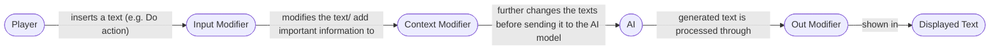

# AI Dungeon Scripting

**Overview:** Scripting in AI Dungeon allows for more intricate and complex story telling. Essentially giving players the tools to alter the input and output messages, along with taking advantage of its already existing system.

## Input/Output Manipulation

This is the most basic and simple form of scripting, which is changing the **input** message of the user before it get fed to the AI. Or, changing the **output** message by giving the AI commands. 
- These are all **invisible**, meaning, the manipulation occurs in the background.

Checkout the **UWU** folder under ai_dungeon_scripting, it is a great example of HOW **texts** are manipulated.
- instructions for *string* edits are passed through for input and output.

## RPG Mechanics

Implementing RPG mechanics is much more complex, as there are many more **functions** and **constants** required to make the mechanic work.
- Even then, I find it difficult to make it operate properly.

## RPG Folder Example
I found this premade RPG with dice roll on Git. My initial implementation did not work as there was an error that prevent it from running. After tinkering it with the help of ChatGPT, I was able to get it running but with with broken dice rolls.

### Dice Rolls
There is a dice roll, but I can't seem to get it to define the roll (I guess the AI doesn't know what it is rolling FOR)
- The AI currently rolls for **all** text input.(I can't seem to get it only roll for certain inputs.)

### Inputs & Context
 It appears that they **update** the character stats through each **input**. This operates with the **context** which is getting the AI information about the newly introduced **rules**/**world** so that it has the necessary information required to produce expected results.

- Ai is given context of the character stats, and character stats are sent during each input.

- It appears that if the **player** levels up, they are sent(input) to the AI to update the stats.

- Context ensures that the AI is always aware of the rules.

### Flow Process

*Context modifier is crucial as it is the final process of organizing the information before sending it to the AI Model for processing.*

*Each "modifier" has params, which can be referenced directly* You will also noticed all of these params used in the "javascript" files in this doc.

*Users also have access to some **core** functions of AI Dungeon like **story cards**.

Note: Parameters and functions are written as *notes* on the web when the player interacts with **scripting**.

As for the memory, AI Dungeon uses **auto summarization** of the previous text to act as a memory bank, this summary will be added into context before it is processed by the AI Model.

So essentially, the RPG mechanics work by providing the AI Model the appropriate **context**. The rules, the character status, what they can or cannot do at what level, or what happens when they reach certain level. And all of this is being updated after each input. The memory system keeps your progress in check so it doesn't forget what you have done, and all that goes in the **ContextModifier** each iteration. The Model then generates the output that is then processed before the user sees it.
- Note that there are a lot of trial and error for this in order to acquire a stable result.

