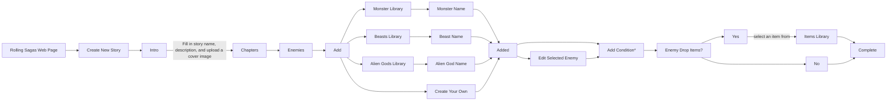

# Enemies

Overview: There will be a wide variety of enemies in the game of Call of Cthulhu. From classical werewolves and zombies, to eldritch abominations and cosmic Gods. Whatever type of enemy the player chooses to include in their story, we need to provide a wide assembly of these "monsters" for them to choose from, build upon, or modify to fit their needs.

*I will call these monsters, beasts, and alien Gods (even other humans) using the general term "enemies".*

## Enemy Library

We will need a library to store these enemies, along with their **STATS**, **ID**, **DESCRIPTION**, and **NAME**. When needed, the **Creators** can select whichever enemy they want to **appear** in their story. 

Each Enemy will have the below information:

### Example:

| ID: | Name: | Description: | STR: | CON: | SIZE: | DEX: | POW: | HP: | DMG BONUS: | BUILD: | MP: | MOV: | ATK / RND: | ATK | ARMOR | SAN LOSS: |
:-- | :-: | :-: |:-: | :-: | :-: | :-: | :-: | :-: | :-: | :-: | :-: | :-: | :-: | :-: | :-: |--:
001 | Zombie | Walking Dead that can bite, claw, and loves to eat human flesh | 80 | 80 | 65 | 35 | 05 | 14 | 1D4 | 1 | 1 | 6 | 1 | 30%, 1D3 + DMG Bonus | - | 0 / 1D8

As you can see, there are many **stats** that go into an enemy, similar to characters, but they are necessary since they are taken into account during **combat**. 

### Notes:

-  **Creators** are allowed to edit these stats, and names as they see fit. So make sure an edit function is built into it.

- Some enemies can use weapons (swords, staves, etc.)

- When **creators** make edits or develop their own monster, a new **ID** may need to be created ( Programmer please solve this, thank you. )

## Creation Flow

### Add Condition*

It is important to note that when the **creator** adds an **enemy** to the chapter, another box called "Add Condition" should appear below the created enemy. In this box, the creator can add a so-called "rule" for the enemy to give it parameters for its appearance. 

- e.g. Zombie will appear when the players arrive at the cemetery.

A reason for this design is the separate enemy rules from other chapter rules for clarity and better user experience. Especially when they need to make changes or edits.

### Items

There are also times when enemies can drop **items** for the player. Although this does not always need to be the case. Depending on the **item**, the **creator** can choose the **probability** and **amount** of items dropped (Can't let the creator accidentally overpower the player.)

- **Creators** will also need to determine whether the enemy would drop an **item**. If the enemy **does** drop an item, then they can select from the items list.

*I will go deeper about the items/equipments in another document.*

### User Created Enemies

Creators are more than welcome to create their own unique imaginary enemy for their story. Just like the preset enemies, they will need to fill out an information sheet for their imaginary enemy. 

- Since enemies can have a wide variety of stats (Great Old Ones having ridiculous stats), we will not limit the player's imagination in this regard. **However**, to help better guide player into making a game with a better experience, we will include an **option** to use our **preset** enemies as **template**.

- Creators can also select the type of die they would like the use for the enemy's attack and sanity loss.

- Creators will need to select the **attack** proficiency.

Final Remarks: I believe we should have information icons beside each section when creators build their own enemy, that way it can answer any potential questions they may have for each category. We can also give them a bit of context and recommendation too. 

## Gameplay Appearance

Once the condition is set, when the player experiences a story, they may or may not trigger the condition. If the condition is triggered, then the system will pull from the **Chapter, Enemy** list to summon the respective **Enemy**.

## Inventory

Items acquired in combat should also go into the player's inventory. So this must also be designed. But shouldn't be a problem since it's a shared system.

## Player Messages

1. There also needs to be some form of messaging system / text base system that tells the player they have acquired an **item** (Similar to Pokémon).

2. A message to inform the player they have successfully defeated the enemy, which ends the battle. 

3. A message to inform the player that they are killed by the enemy, which ends the battle & displays "YOU DIED".

4. A message at the start of battle to set the mood.