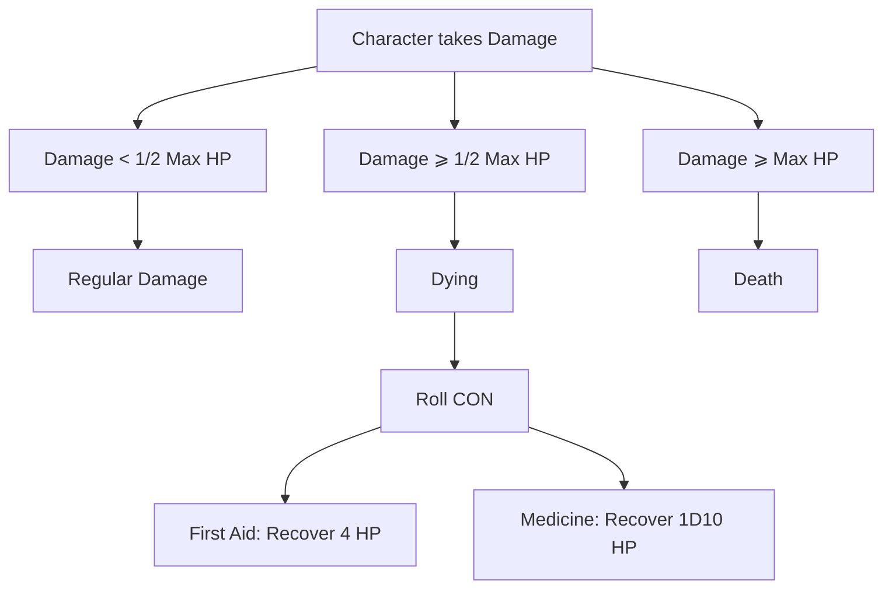
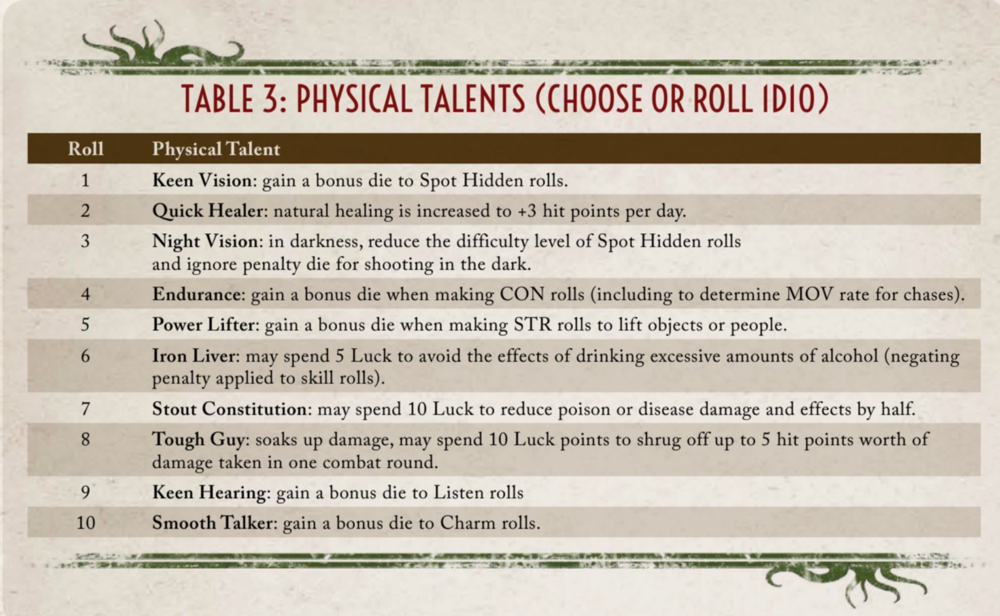
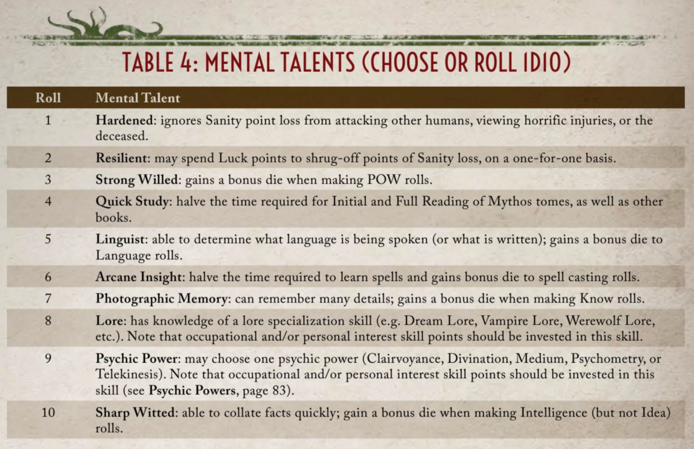
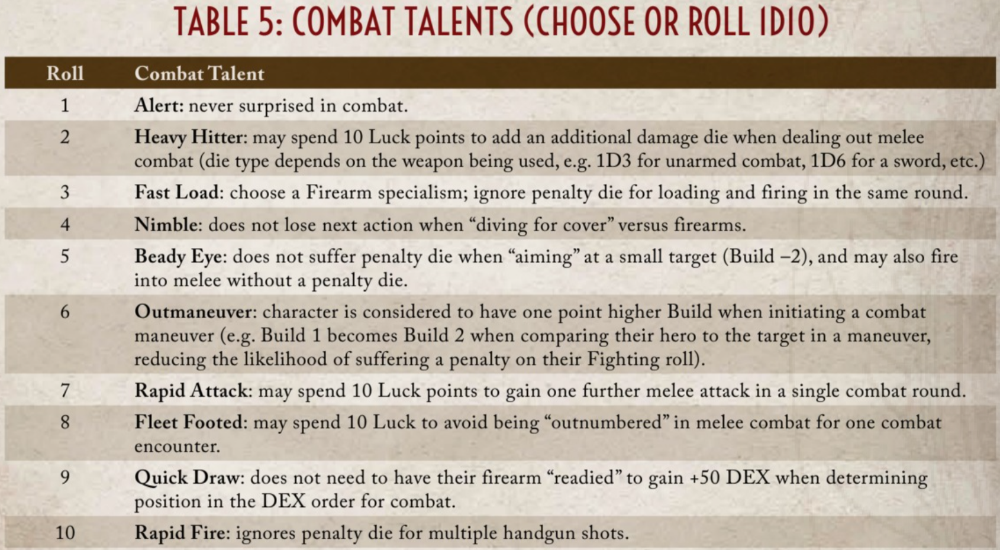
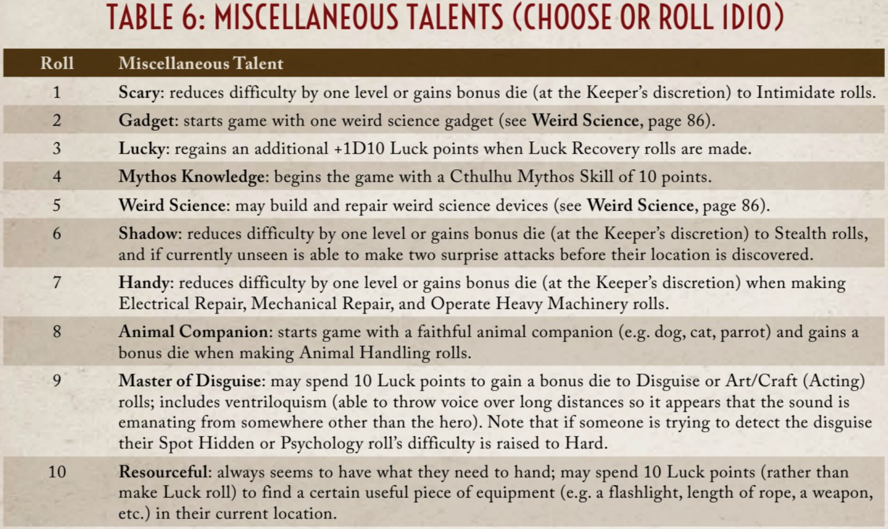

# Battle System

## Overview:

The purpose of this document is for the reader, specifically the programmer, to understand the relationship between PLAYER and ENEMY during COMBAT. This includes basic rules of initiative, player choices, enemy behavior, etc. Through this understanding, the programmer should be able to convert it all into code.

Do try to understand the basic rules of CoC before going through this document; it would greatly help your understanding.

## Combat Initiated:

When combat is initiated in the story, it would bring the player to a different screen (think of Pokémon). In this space, combat will follow very specific rules based on the CoC rule book along with some minor adjustments that would best fit our purpose.

[Check Graph Here](../battle_system/rs_battle_flow2.md)

### Establish Order of Attack:

When COMBAT begins, the player's DEX is compared to the enemy's DEX to determine who has the initiative! Certain characters will have unique perks that may modify their initial DEX value.

- IF: Player has the higher DEX, then they go first!
- Else: Enemy attacks first and the player must react! They can choose either dodge or fight back (detailed rules below).

### Dodging:

Simply compare the attacker’s chosen fighting skill against the target/defender’s dodge skill.
- If attacker has a higher level of success → Attacker deals damage
- If target/defender has a higher level of success → Target/defender avoids damage
- If the level of success is a draw, the target/defender avoids damage.
- If both fail their roll, neither of them deals damage.

### Fighting Back:

Simply compare the attacker’s chosen fighting skill against the target/defender’s chosen fighting skill.
- If attacker has a higher level of success → Attacker deals damage
- If target/defender has a higher level of success → Target/defender deals damage
- If the level of success is a draw, the attacker deals damage.
- If both fail their roll, neither of them deals damage.

As you can see, if the player's health reaches 0, they would die and the game would end. If not, the game continues and it is the player’s turn to retaliate. The player has 3 distinct choices they could make:

1. Fight
2. Items
3. Flee

I will go through each of these choices and the gameplay loop for the combat system below.

*Note: the perk list is in the appendix; feel free to check it out.*

### Fight:

[Check Fight Diagram Here](../battle_system/rs_battle_fight_flow_sequence_diagram2.md)

We can start on this diagram from two distinct points depending on, you guessed it, which actor has the higher DEX. But for our purposes, we will start from the player.

- If the player character has no weapon equipped, then they would initiate a brawl attack against the target if they tap "Fight".
- If the player character has a weapon(s) equipped, then a “small window” should open to allow the player to choose their preferred method of approach (note that the small window is just an example).

Apply bonus or penalty die depending on the target size, target movement speed, and number of shots fired if using ranged weapons.

[Check Range Diagram Here](../battle_system/rs_battle_fight_range_sequence_diagram.md)

#### Using a firearm:

- Select a specific firearm skill.
- Roll a 1D100 for attack success ( Difficulty of success is based on ?)

#### Fast-Moving Targets:

Fast-moving targets are hard to hit (MOV 8 or more). Shooter receives 1 penalty die.

#### Target Size:

- If the target’s build is ≤ -2, the shooter receives 1 penalty die.
- If the target’s build is ≥ 4, the shooter receives 1 bonus die.

#### Handguns - Multiple Shots:

Firing 2 or 3 shots in 1 round requires the shooter to roll 1 penalty die for each shot fired.

Furthermore, if the player’s character has any relevant perk that would modify the attack probability, apply it here (e.g., “Beady Eye”).

Enemies will always fight back, thus:

#### Player Initiates an Attack:

- Choose an attack the investigator will perform (brawl, firearms, fencing*, etc.).
- Roll for attack success (Refer to table 1-1).
- If successful → Damage Value based on weapon damage from weapon table.

At Extreme Level of Success when attacking:
- Impale = Max Damage + Max Damage Bonus + Roll Weapon Damage
- Blunt = Max Damage + Max Damage Bonus

#### Enemy Fights Back:

Simply compare the attacker’s chosen fighting skill against the target/defender’s chosen fighting skill.
- If attacker has a higher level of success → Attacker deals damage
- If target/defender has a higher level of success → Target/defender deals damage
- If the level of success is a draw, the attacker deals damage.
- If both fail their roll, neither of them deals damage.

Apply any perk modifiers to the player’s attack if the enemy fails to fight back. If the perk is passive, apply automatically. If the perk is active, give the player the decision if they would like to activate the perk (e.g., Rapid Attack).

Depending on the amount of damage and the initial health bar of either character, this could result in death of either character which would promptly end the battle or result in game over.

Once the above has been resolved and the enemy is still alive, then it would be their turn to attack, which the player can choose to either dodge or fight back.

#### Player Dodges:

Simply compare the attacker’s chosen fighting skill against the target/defender’s dodge skill.
- If attacker has a higher level of success → Attacker deals damage
- If target/defender has a higher level of success → target/defender avoids damage
- If the level of success is a draw, the target/defender avoids damage.
- If both fail their roll, neither of them deals damage.

#### Player Fights Back:

Simply compare the attacker’s chosen fighting skill against the target/defender’s chosen fighting skill.
- If attacker has a higher level of success → Attacker deals damage
- If target/defender has a higher level of success → target/defender deals damage
- If the level of success is a draw, the attacker deals damage.
- If both fail their roll, neither of them deals damage.

Note: that some enemies can attack multiple times, if so, just go back to and initiate the attack until they are finished.

Again depending on the damage, it may result in either character's death, exiting the battle or game over. 

If both actors are alive, then the loop starts again at until one of them is dead.

### Items:

Players can use items on their character to heal themselves or maybe give them a boost to even out the odds during battle. Player’s character will receive some of these items at the beginning of their journey (or find them while they explore the world).

[Check Items Diagram Here](../battle_system/rs_battle_item_flow_sequence_diagram.md)

As you can see, it shares many similarities with the fight loop. When the player selects items, they can select and use a desired item from their inventory.

#### Example Items:

- First Aid: +1 HP
- Medicine: +1D3 HP

If the player decides to use an item, depending on the item being used, they may need to roll for its effects. Once that is complete, it would be the enemy’s turn.

Once the above has been resolved and the enemy is still alive, then it would be their turn to attack. which the player can choose to either dodge or fight back.

### Flee:

Sometimes the wisest decision is to retreat. One can’t fight another day if they are dead, after all.

[Check Flee Diagram Here](../battle_system/rs_battle_flee_flow_sequence_diagram.md)

When the player decides to flee, all actors must make a constitution roll:

#### Flee:

All actors must make a constitution roll:
- Roll Success: no change to their MOV stat.
- Roll Extreme Success: +1 to their MOV stat.
- Roll Fail: -1 to their MOV stat.

If the player’s MOV stat is ≥ enemy MOV stat, then they have successfully escaped.
If the player’s MOV stat is < enemy MOV stat, then they have failed to escape.
When the player fails to escape, it would automatically be the enemy’s turn.

Once the above has been resolved and the enemy is still alive, then it would be their turn to attack, which the player can choose to either dodge or fight back.

## Taking Damage / Receiving Hits

I have modified the way player characters take/receive damage so it better fits the single-player experience and story line (Character is harder to kill).

## Appendices

### Perks:

### Table 1-1: Level of success determination chart with a D100

| Critical Success | Extreme Success        | Hard Success          | Success               | Failure           | Critical Failure |
|------------------|------------------------|-----------------------|-----------------------|-------------------|------------------|
|       1      | ≤ Skill Value / 5      | ≤ Skill Value / 2     | ≤ Skill Value         | > Skill Value     | 100              |

### Table 1-2: Modifiers for the character performing a maneuver. (Attacker’s build - target build)

| Build: ≥ 0       | Build: -1             | Build: -2             | Build: -3             |
|------------------|-----------------------|-----------------------|-----------------------|
| None        | 1 Penalty Die                  | 2 Penalty Die         | Impossible         |
