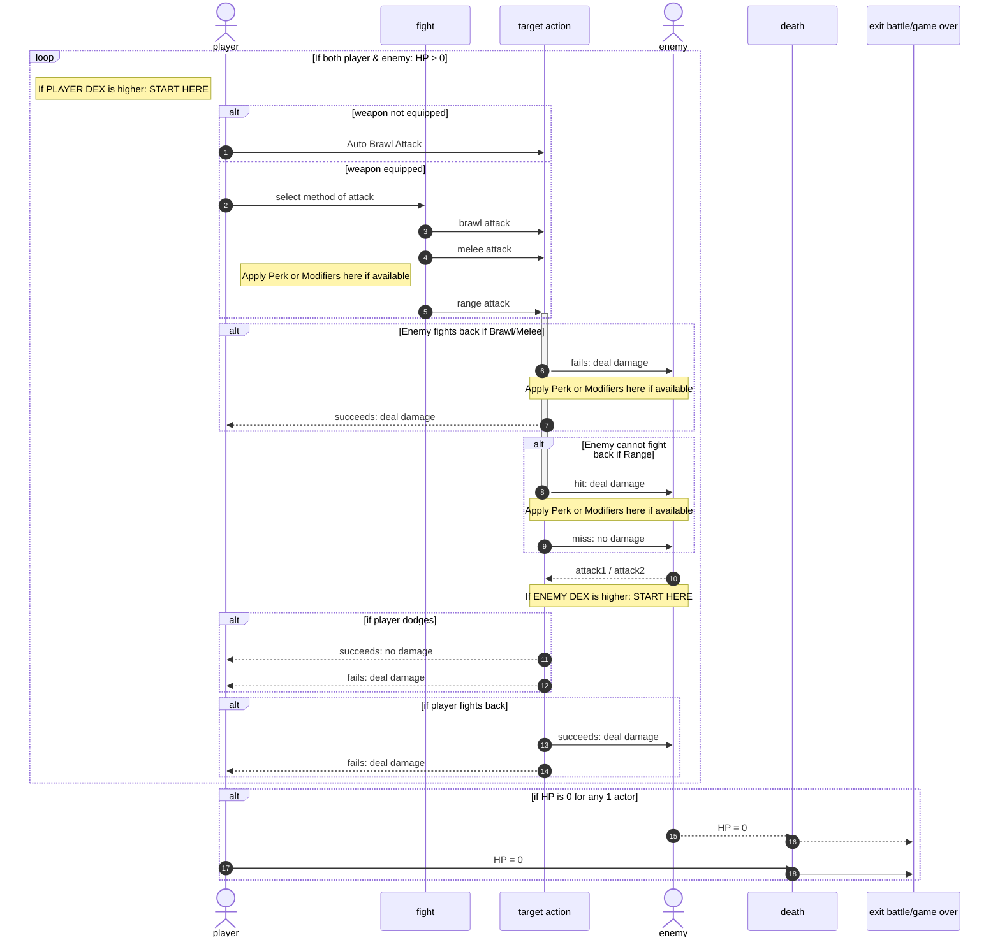

---
Battle: Fight
---

```mermaid
    sequenceDiagram
    autonumber
    actor player
    participant fight
    participant target action
    actor enemy
    participant death
    participant exit battle/game over

    loop If both player & enemy: HP > 0
        note left of player: If PLAYER DEX is higher: START HERE
        alt weapon not equipped
        player->>target action: Auto Brawl Attack
        else weapon equipped
        player->>fight: select method of attack
        fight->>target action: brawl attack
        fight->>target action: melee attack
        note left of fight: Apply Perk or Modifiers here if available
        fight->>+target action: range attack
        end
        alt Enemy fights back if Brawl/Melee
        target action->>enemy: fails: deal damage
        note over target action, enemy: Apply Perk or Modifiers here if available
        target action-->>player: succeeds: deal damage
        end
        alt Enemy cannot fight back if Range
        target action->>-enemy: hit: deal damage
        note over target action, enemy: Apply Perk or Modifiers here if available
        target action->>enemy: miss: no damage
        end
        enemy-->>target action: attack1 / attack2
        note over enemy, target action: If ENEMY DEX is higher: START HERE
        alt if player dodges
        target action-->>player: succeeds: no damage
        target action-->>player: fails: deal damage
        end
        alt if player fights back
        target action->>enemy: succeeds: deal damage
        target action-->>player: fails: deal damage
        end
    end
    alt if HP is 0 for any 1 actor
    enemy-->>death: HP = 0
    death-->>exit battle/game over: 
    player->>death: HP = 0
    death->>exit battle/game over: 
    end
```

