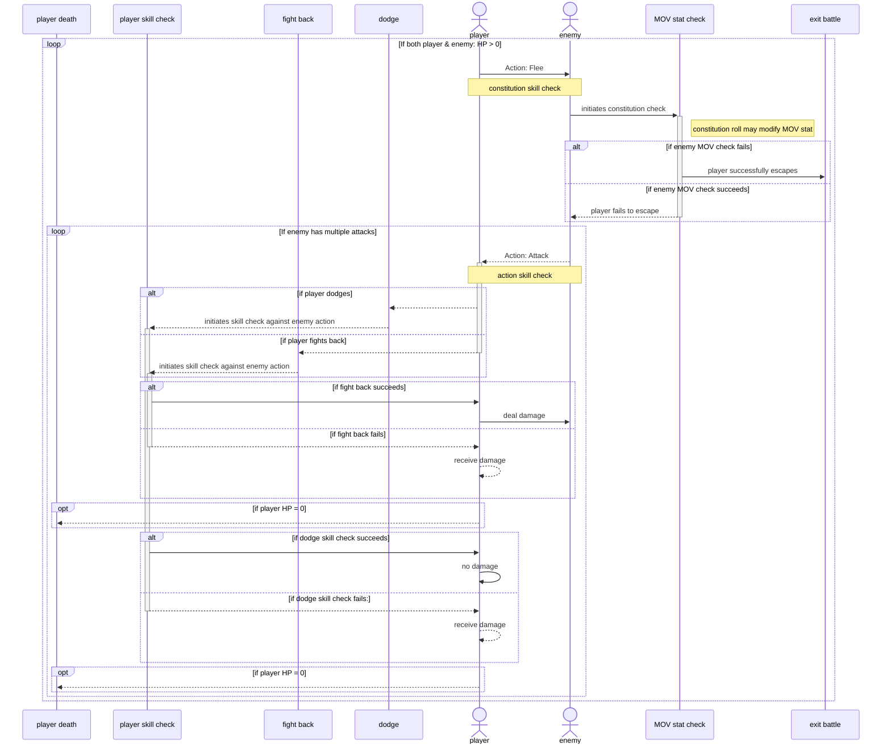

---
Battle: Flee
---

```mermaid
    sequenceDiagram
    participant player death
    participant player skill check
    participant fight back
    participant dodge
    actor player
    actor enemy
    participant MOV stat check
    participant exit battle
    

loop If both player & enemy: HP > 0
    player->>enemy: Action: Flee
    note over player, enemy: constitution skill check
    enemy->>+ MOV stat check: initiates constitution check
    note right of MOV stat check: constitution roll may modify MOV stat
    alt if enemy MOV check fails
    MOV stat check->> exit battle: player successfully escapes
    else if enemy MOV check succeeds
    MOV stat check-->>- enemy: player fails to escape
    end

loop If enemy has multiple attacks
    enemy-->>+player: Action: Attack
    note over enemy, player: action skill check
    alt if player dodges
    player-->> dodge: 
    dodge-->>+ player skill check: initiates skill check against enemy action
    else if player fights back
    player-->>- fight back: 
    fight back-->>+ player skill check: initiates skill check against enemy action
    end

    alt if fight back succeeds
    player skill check->> player: 
    player->> enemy: deal damage
    else if fight back fails
    player skill check-->>- player: 
    player-->> player: receive damage 
    end
    opt if player HP = 0
    player-->> player death: 
    end

    alt if dodge skill check succeeds 
    player skill check->>player: 
    player->> player: no damage
    else if dodge skill check fails: 
    player skill check-->>-player: 
    player-->>player: receive damage
    end
    opt if player HP = 0
    player-->> player death: 
    end
end
end
```