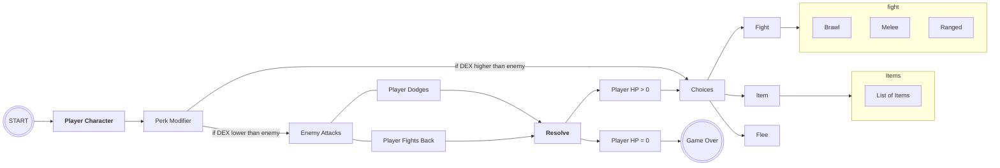

---
Simplified Flowchart: Player's Perspective
---

```mermaid
flowchart LR
    id0(((START)))
    id1["`**Player Character**`"]
    id1a[Perk Modifier]

    id2[Choices]
    id3[Enemy Attacks]

    id2a[Fight]
    id2aa[Brawl]
    id2ab[Melee]
    id2ac[Ranged]

    id2c[Item]
    id2cb["`List of Items`"]

    id2d[Flee]


    id3a[Player Dodges]
    id3b[Player Fights Back]
    id4["`**Resolve**`"]
    id5[Player HP > 0]
    id6[Player HP = 0]
    id7(((Game Over)))

    id0-->id1
    id1-->id1a
    id1a-- if DEX higher than enemy -->id2
    id1a-- if DEX lower than enemy -->id3
    id2-->id2a
    id2-->id2c
    id2-->id2d

    id2a-->fight
    subgraph fight
   id2aa
   id2ab
   id2ac
    end


    id2c--> Items
    subgraph Items
    id2cb
    end
    


    id3---id3a-->id4
    id3---id3b-->id4
    id4-->id5
    id4-->id6
    id5-->id2
    id6-->id7
```