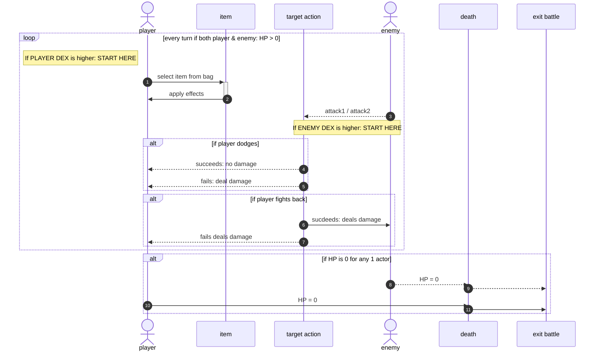

---
Battle: Item
---

```mermaid
    sequenceDiagram
    autonumber
    actor player
    participant item
    participant target action
    actor enemy
    participant death
    participant exit battle

    loop every turn if both player & enemy: HP > 0
        note left of player: If PLAYER DEX is higher: START HERE
        player->>+item: select item from bag
        item->>-player: apply effects
        enemy-->>target action: attack1 / attack2
        note over enemy, target action: If ENEMY DEX is higher: START HERE
        alt if player dodges
        target action-->>player: succeeds: no damage
        target action-->>player: fails: deal damage
        end
        alt if player fights back
        target action->>enemy: sucdeeds: deals damage
        target action-->>player: fails deals damage
        end
    end
    alt if HP is 0 for any 1 actor
    enemy-->>death: HP = 0
    death-->>exit battle: 
    player->>death: HP = 0
    death->>exit battle: 
    end
```

