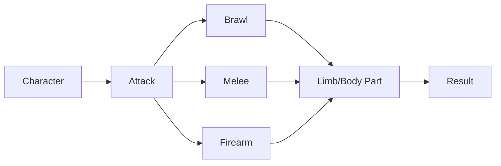
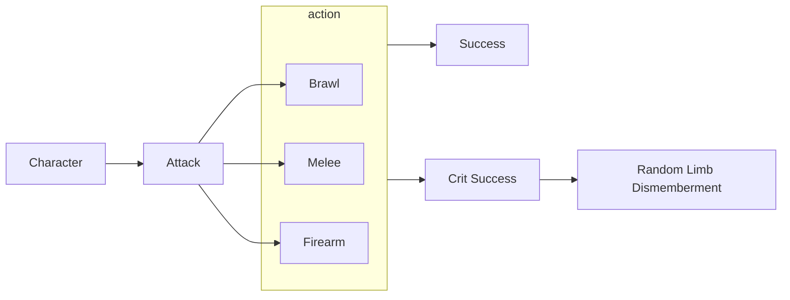

# Combat Sytem 2.0

**Overview:** Given the recent change's in the game's direction, we will be implementing **3D** character models in the future. The purpose of the 3D modeled character is to enhance the player's experience with story immersion. This is achieved by introducing these characters into combat, where player's can **see** their character's **in action**, fighting against eldritch beasts and monstrosities. The use of 3D models allows us to include stylish combat animations that is unique and exciting. 

Below I will propose some ideas on what our combat could potentially look like.

## Combat System A: Turn-Based Tactical Combat

This combat system is modeled after **Darkest Dungeon 2's** combat system. Its enemy placement style allows many elements in **Call of Cthulhu** to be implemented. 

The combat mechanic of **DD2** has multiple complex systems working with each other to determine many combat actions and results. **But in our case, we will simplify this to our need and apply CoC rules to the combat.** Despite of that, there is a good reason to utilize the DD2 combat system for our game, **many aspect of the game aligns with CoC**.

*With this unit placement style, there is the concept of **distance** blended with **strategy**.* 

This representation of the units gives the player full view of their characters during combat, watching them battle, fight, dismember, and kill.

### 3D models

Since we will be using 3D models for our game, it is imperative that we present these models whenever we can. As player's spend more time with the character, the deeper the emotional bonds can become, and the more they care.

There will also be 3D models for enemies, making the threat appear more real.

#### Animation

There will be a multiple preset animations for all characters *(brawl, sword fighting, firing a gun, etc.)*. As seen in **Darkest Dungeon 2**, these animations are explicitely demonstrated during combat. 

*They have made the attack animation pop out and do a still image, and another animation plays that returns the characters to their original postion. We don't need to follow this necessarily, and have the characters just complete the animation on screen.*

**But special characters can have unique animations. This would further encourage player's to collect certain characters.**

### Combat

#### Position & Rank

DD2's combat divides the player character's and enemy character's into **ranks/positions**. This determines the range of enemy a character can hit (**distance**), and the effectiveness of said skill (**strategy**). 

*For our purposes, it would look more like this. 1 v 1 or 1 v 2.*

#### Distance

The way the character's are positioned, it automatically creates **distance** between the character and enemies. This in fact works very well with our game as it also has *firearms* in combat scenario. Weapons like handgun, shotgun, and rifles will have different roll difficulty depending on the enemy distance **(exactly like CoC)**. This will adda layer to strategy during combat, creating situations where a firearm may not always be the best choice at every given time!

#### Strategy 

With the introduction of distance, it would naturally create various types of strategy when there are different enemy types and when there are multiple enemies. Player's will naturally need to determine which enemy they need to **prioritize**, which is a greater **threat**, and if they should even **engage** in the combat at all (especially when it is unfair!).

#### Dismemberment

This will be a mechanic that does not originate from DD2, instead, this will be borrowed from **Fear & Hunger**.

*Characters can attack enemy limbs.*
- *Left Arm*
- *Right Arm*
- *Left Leg*
- *Right Leg*
- *Torso*
- *Head*

*As you can see, the ogre monster is holding a cleaver with his left hand. Player can TARGET that left hand/arm.*

*If the attack was successful and powerful enough, then the enemy is dismembered.*

Dismemberment adds multiple dimensions to combat, prioritization and strategy. These all add another layer of decision making, enhancing the combat experience for the player.

Ontop of that, different weapons will have variable dismemberment ability, e.g. *Sword* vs *Revolver* vs *Pipe*. Each of these weapons also inflict different type of damage, *slash* vs *pierce* vs *blunt*.

---
 **Implementation Method A:** We utilize the same exact system and allow players to target enemy's specific limbs.

The player's decision will essentially flow like this for combat. The **result** will be where the **dice roll** occurs, which will determine the attack success and damage.

---

**Implementation Method B:** We subtract the limb/body part targeting, but include dismemberment into **critical success** rolls.

In other words, **critical success** would mean a random limb would be completely dismembered. If they are lucky, they may chop off the enemy head (but not all enemy has their head as a weakness).

For this implementation method, there is less decision making, and more **emphasis** on the **dice roll**.

### Multiplayer

The direction of the game's development will eventually strive towards cooperation gameplay and player interaction with each other. The combat mechanic of DD2 allows for additional player's to be inserted into battle, making them each take up a different postion.

*A full party can potentially look like this. All the player's are on the left side, and they can decide where thier character should be positioned.*

#### Time Constriant

We can also implement a timer for each player's action to create a sense of urgency, danger, and thrill. This would naturally push the game forward and create less wait time.

*This could be an option in settings, as some player's want to move things slower.*

*It would be similar to BG3, co-op with other players with the additional timer on their action so it pushes the combat forward faster.*

## Combat System B: Classic Turn-Based Combat

This combat system follows the more classic and traditional turn-based combat that is seen in old school RPG. CoC combat aligns with this style of combat too as it adheres to the "we all take a turn in a specific order based on "X" stat". Ofcourse, CoC has its own nuaces, but in the grand scheme of things, it is very similar. With so many turn-based combat out there, a easy and straight forward one I think we can use as a template is **Final Fantasy X**.

- Dragon Quest also uses this style.

*Characters and enemies take turns depending on their speed stat, and can take actions such as attack or use items.*

### 3D Models

It is clear that FFX uses 3D models for their game, which we will be doing the same. 

#### Animation

Just like FFX, there will be animation for the characters depending on the type of weapon they are utilizing. With this combat style, there can even be special effects for a more dramatic expression.

*They added a streak for the swing, which is something we can consider. But there is an animation of the guy running towards the enemy and swinging.*

- It is important to note that animation style like this requires more work being invested. 
- We can potentially make the enemies and characters stand closer, and instead of running animation, it can be a quick shift.

**Again, special characters can have unique animations. This would further encourage player's to collect certain characters.**

### Combat

Combat is simple, and there isn't a position/rank system. Anyone is free to attack which ever unit they see fit.

There is also a **Turn Order Visibility** system, this allow players to strategize around order of action.

### Strategy

Traditional has many mechanics that are incorporated into the game to add depth to the strategy gameplay experience. For our purposes, we will be subtracting a few of those mechanics in order to simplify the combat experience. 

#### Turn Order Visibility

This system reveals the action order of all the units on the field. 

*With turn order visible, player's can strategize around the order. E.g. Attack/Kill monster A & C as they are higher on the priority list.*

Player's can now place different priority to different enemies, making some more urgent than others. This will be further emphasized when there are hard hitting enemies but are also slower.

#### Enemy Weakness

Although the monster and cosmic beasts don't offficially have a specific **weakness**, this is often incorporated by the **keeper**. Since we will have different type of weapons in the game, the variable type of damage they inflict can be incorporated into enemy weakness *(e.g. Deepones can be more resistant to **slash damage** and weak to **pierce damage**)*.

*There is a elemental weakness to the Octopus monster. Similar to pokemon, enemies recieve additional damage when hit by their weakness.*

- Another game that has a great **enemy weakness system** is **Octopath Traveller**. This game has **weapon** & **elemental** weaknesses present for the enemies.

- We can also potentially allow player's to use specific items in their bag to inflict damage too. Torch to burn cosmic plant enemies.

#### Dismemberment

Exactly like the previous proposal.

### Multiplayer

Like traditional RPG, the party size can increase to a comfortable 4. This is a tested number where it increases player engagement and reduce waiting time before one would take **another action**.

*Although it is shown as a party of 3 here, it could easily increase to 4 and still have the same experience.*

*Essentially making a point how a party of 4 is a very standard and comfortable multiplayer size.*

Again, the fact that we are progressing towards multiplayer means that we need a combat system that can grow into it.

#### Time Constraint

Similar to my previous proposal, there can be a **action time limit** option for players when engaged in multiplayer. Again, it is essentially there to push the game forward and reduce waiting time among players.

## Comabt System C: Tactical RPG

