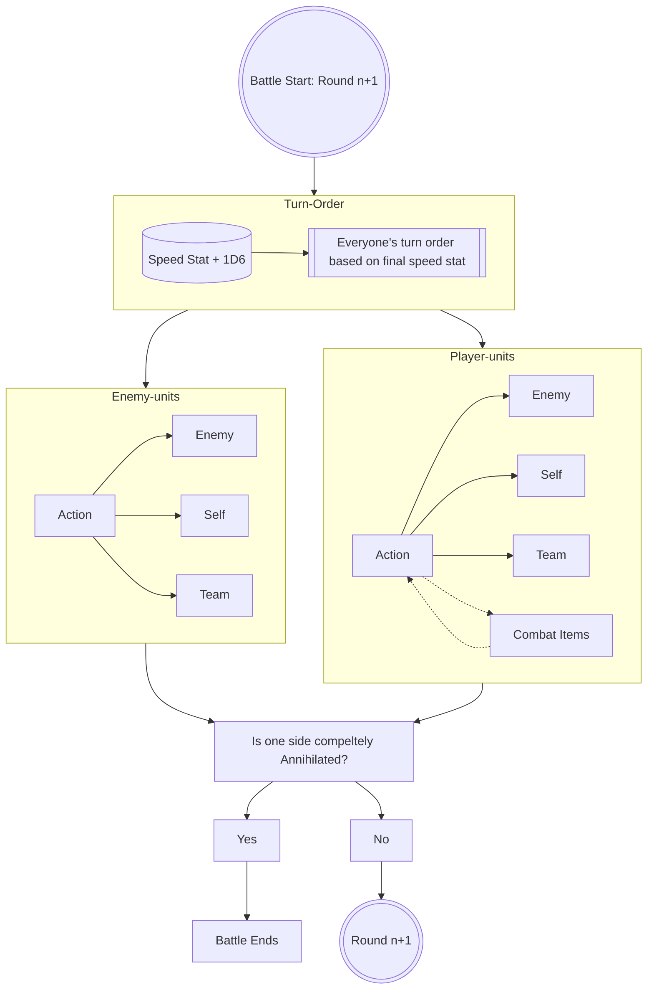
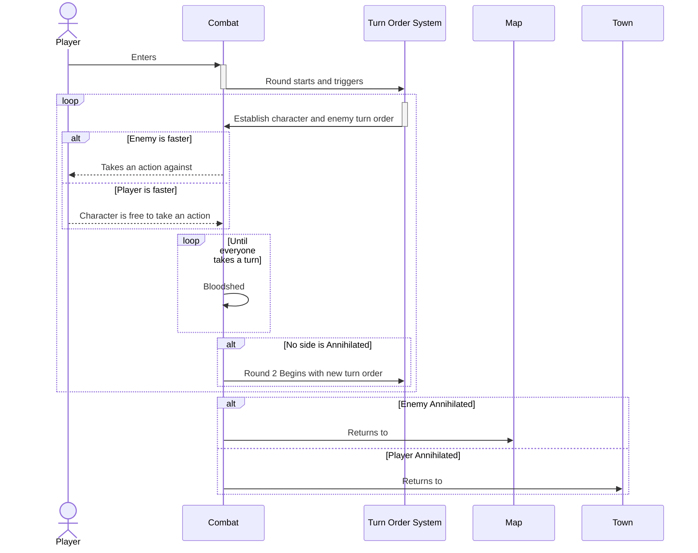

# Darkest Dungeon 2 Combat Framework

**Overview:** This document will take a deep dive into the combat framework and mechanics of **Darkest Dungeon 2**. In order to better implement this mechanic into our game, it is imperative that we understand the inner workings. I will cover turn order, position, stress, status effects, environment, unique token system, enemies, bosses, mastery system.

Furthermore, I will also touch on the combat flow, how fights frequently go, and the information given to players during the fight in order for them to strategize.

## Position

First mechanic I will dive into for DD2's combat framework is **position**, the reason being it is the **first** combat related mechanic the player actually interacts with, even before their first fight, as the character's postion determine the efficiency and strength of the party.

*As you can see, character's have preferred **ranks/position** along with **target preferrences**.*

*Furthermore, some character skills have positional conditions. Plague doctor here can only use his **plague grenade** from rank 3 & 4, and only hit enemies in rank 1 & 2.*

It is imperative that they player strategically position their party members to better maximize their skills and damage. Any attacks outside of their preferred position or target range will be imposed with penalties *(Lower accuracy, reduce status effect chance, decrease damage output)*.

## Turn Order

Once the positions are setup, the player will undoubtedly encounter enemies. At the start of battle **(specifically, THE START OF EACH ROUND)**, the system will determine the **turn order** of all characters in play with a simple calculation:

Character's Turn Order = Character Speed + 1D6

Those with a higher total will attack first, and those with lower will attack later. With the 1D6 roll, it is hard to determine who will attack first basing off of their indiviudal **speed** stat. 

*Red Box: Turn order is visible to the player once it is established, this gives player the chance to **strategize** and **plan** ahead for their approach.*

### Turn Order Modifiers

Character's base speed stat is infact **not** the only thing that can potentially influence its turn order.

#### Abilities & Skills

Some character's can apply either **buff** to themselves or others to increase **speed** for a **limited** turn. This can influence the current round's turn order, or the next round's turn order.

- The buff can be a **Token** (which is a type of buff with a fix set of stats).
- The buff can also be just increasing a specific stat or effect in percentages.

*Duelist character can give themselves a speed buff*

#### Status Effects

Just as characters can apply buffs, they could also apply **debuffs** to enemies, reducing their turn speed. Again, this can influence current round and or future rounds.

*Caltrops can reduce enemy speed for 3 turns*

There are also instances where the player will come across a node on the map, and is required to make a decision. This decsion could also impact status affects during combat.

*At the bottom, we can see the gains and losses. There are also instaces where it can increase speed or attack*

## Environment

All combat encounters occur in a specific environment within a specific region. This can impact battle strategy, generating a unique experience for every new encounters.

For example, in the region: Shroud, there is a chance that a fog would roll in during battle, imposing buffs and debuffs to all characters.

*Some characters are blinded, while others are vulnerable.*

### Obstacles

There could also be obstacles on the battlefield, increasing diffuclty or forces a chance in the usually strategy. Either way, it adds variability to encouters.

*Here a barricade takes the first rank, protecting the units behind it.*

## Tokens

Tokens are essentially **status effects** with a fixed stat, and there are **2 types**: Positive (Buffs), Negatives (Debuffs)

Some tokens grant unique abilities like counter attack (e.g. Riposte).

*There can be many different tokens applied to a character at any given moment. It can be both positives and negatives.*

There are also unique **tokens** that are tied to specific **characters** and **enemies**. Thus it is party of the game play look for player's to maximize their buffs while evading or manage debuffs.

### Damage Over Time

Characters and enemies can both inflict **DOT** effects:
- Bleeding
- Blight
- Burn

The three of them function identically but is effective on different enemies since there are a variety of resistance among them.

## Enemies

There are many different kinds of enemies in the game to give variability and different challenges in the game. Regardless, I will take a deep dive into one example, and take a look at how it interacts with the existing combat mechanic, and how players can develop strategies for it.

### Fisherfolk: Docker

**Docker** is a tougher enemy that appears in **The Shroud** region.

*It has high HP and deals heavy damage. He also comes with a token called "Death Armor".*

*We can see that certain skills **cannot** activate in certain positions.*

**Note that the above information can be found during combat by clicking on the enemy, also called: Academic View**

Player can maximize their attack by exploiting its weakness, alter its position to back ranks so it deals less damage, or even prioritize it and attempt to take it down ASAP.

I would also like to put an emphasis on the skill "Brine Bucket", for it may also add "Barnacle Token", dealing damage if the player's characters move among the ranks. It also takes up 2 ranks/positions due to his size, a very simple and **intuitive** way of saying "he's dangerous".

## Combat Flow

Combat takes place over a number of rounds, and during each **round** every unit takes a **turn**. During their turn they can take an **action** or use a **combat item**. Once everyone completes their **turn**, the next **round** would begin, this will repeat until one side is annihilated.

### Player Combat Journey

    

## Supplementary Information

Additional elements that may influence combat outcome.

### Flame

The status of the flame could provide **buffs** or **debuffs**.

*e.g. The denial confession would give these modifiers to combat.*

Different confessions will give different hero and enemy modifiers.

### Stress

Characters can accumulate or remove stress in various ways.

Certain actions or results will cause an increase or decrease of stress, 

Enemies can inflict **horror** damage instead of physical damage, pushing the mental state of the characters to the brink of insanity. When that occurs, the character's enter 1 of 2 states *(third state is specific to the Flagellent class)*:

- Meltdown: Apply a random negative quirk
- Resolute: Apply a random positive quirk
- Toxic: Adds a "Toxic" token and a bunch of other effects

**These quirks will also give **buffs** or **debuffs** to said character during combat. Greatly influencing the final result of battle.**