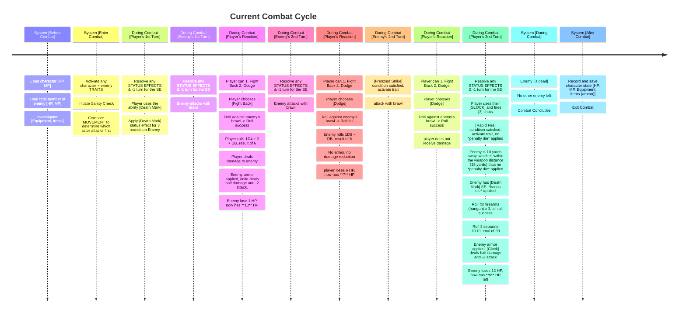
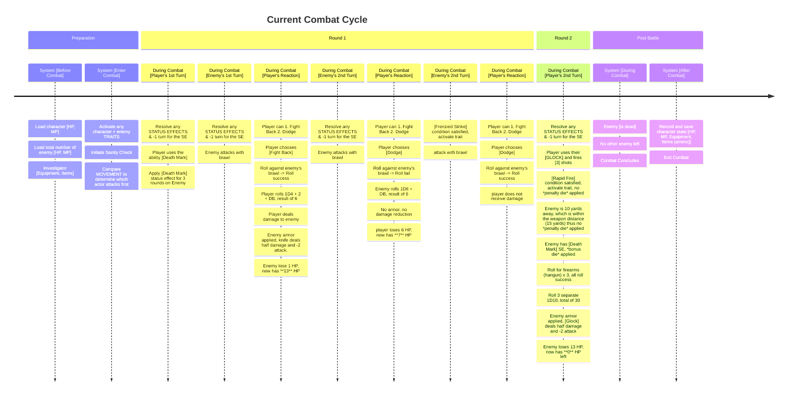

# Combat Lifetime

**Overview:** This document I will propose a combat lifetime for our game's combat system. With the introduction of *status effects* and character/enemy abilities that has *delayed effects*, it is important to map out the cycle of combat, and understanding what exactly occurs or happens during each "frame".

**Player Experience Goal:** The goal of the combat experience should emphasize strategy and enemy prioritization. Player should feel a sense of danger, exploit their advantage over the enemies, and plan their attacks accordingly all the while balancing risk and reward. 

- As for multiplayer, there will be an added layer of cooperation among the investigators, along with positioning in order to go against additional enemies.

## Current Combat Cycle

*Player Character: Jack Carson*
- HP: 13
- MOV: 9
- Skills:
    - Firearms (Handgun 65% )
    - Fighting (Brawl 50% )
- ATK: 
    - Brawl: 1D3 + DB
    - Combat Knife: 1D4 + 2 + DB
    - Glock 17: 1D10 / 15yards / 1(3) Shots per round / Mag:17
- Damage Bonus: 1D4
- Sanity: 60
- Talent: Rapid Fire
- Ability: Marked
---

*Enemy: Mummy 1 (touch distance)*
- HP: 14
- MOV: 6
- Skills:
    - Fighting 70%
- ATK: 1D6 + DB
- ATK/RND: 2
- Damage Bonus: 1D6
- Armor: 2 AP (Impaling weapon deals 1/2 damage).
- Sanity Loss: 1 / 1D8
- Traits: Frenzied Strikes
- Ability: venomous bite
---

