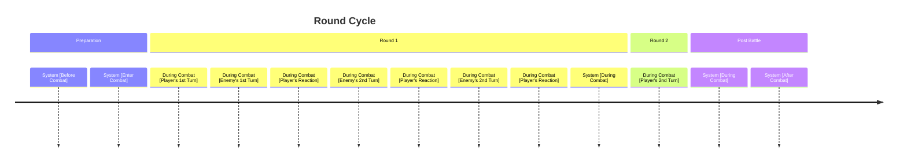
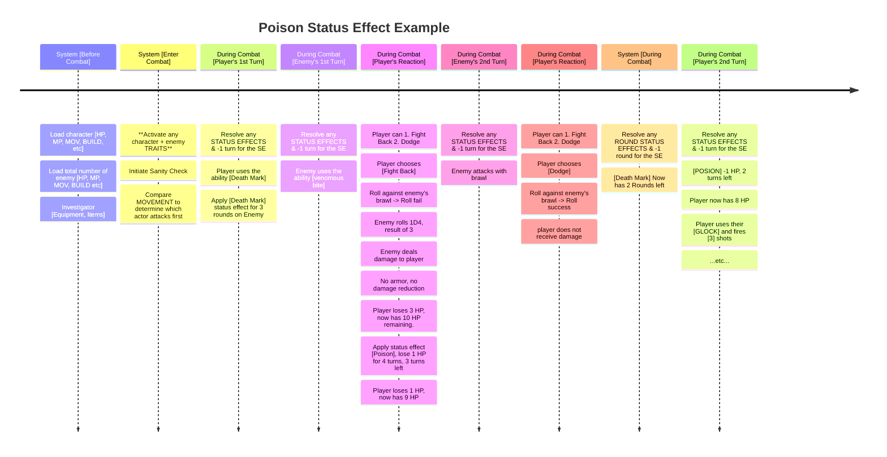

# Combat Lifetime

**Overview:** This document I will propose a combat lifetime for our game's combat system. With the introduction of *status effects* and character/enemy abilities that has *delayed effects*, it is important to map out the cycle of combat, and understanding what exactly occurs or happens during each "frame".

**Player Experience Goal:** The goal of the combat experience should emphasize strategy and enemy prioritization. Player should feel a sense of danger, exploit their advantage over the enemies, and plan their attacks accordingly all the while balancing risk and reward. 

- As for multiplayer, there will be an added layer of cooperation among the investigators, along with positioning in order to go against additional enemies.

## Current Combat Cycle

*Player Character: Jack Carson*
- HP: 13
- MOV: 9
- Skills:
    - Firearms (Handgun 65% )
    - Fighting (Brawl 50% )
- ATK: 
    - Brawl: 1D3 + DB
    - Combat Knife: 1D4 + 2 + DB
    - Glock 17: 1D10 / 15yards / 1(3) Shots per round / Mag:17
- Damage Bonus: 1D4
- Sanity: 60
- Talent: Rapid Fire
- Ability: Marked
---

*Enemy: Mummy 1 (touch distance)*
- HP: 14
- MOV: 6
- Skills:
    - Fighting 70%
- ATK: 1D6 + DB
- ATK/RND: 2
- Damage Bonus: 1D6
- Armor: 2 AP (Impaling weapon deals 1/2 damage).
- Sanity Loss: 1 / 1D8
- Traits: Frenzied Strikes
- Ability: venomous bite
---

```mermaid
    timeline
    title Combat Cycle

    System [Before Combat]
                                        : Load character [HP, MP, MOV, BUILD, etc]
                                        : Load total number of enemy [HP, MP, MOV, BUILD etc]
                                        : Investigator [Equipment, Items]
    System [Enter Combat]
                                        : **Activate any character + enemy TRAITS**
                                        : Initiate Sanity Check
                                        : Compare MOVEMENT to determine which actor attacks first
    During Combat [Player's 1st Turn]
                                        : Resolve any STATUS EFFECTS & -1 turn for the SE
                                        : Player uses the ability [Death Mark]
                                        : Apply [Death Mark] status effect for 3 rounds on Enemy
    During Combat [Enemy's 1st Turn]
                                        : Resolve any STATUS EFFECTS & -1 turn for the SE
                                        : Enemy attacks with brawl
    During Combat [Player's Reaction]
                                        : Player can 1. Fight Back 2. Dodge
                                        : Player chooses [Fight Back]
                                        : Roll against enemy's brawl -> Roll success
                                        : Player rolls 1D4 + 2 + DB, result of 6
                                        : Player deals damage to enemy
                                        : Enemy armor applied, knife deals half damage and -2 attack.
                                        : Enemy lose 1 HP, now has **13** HP
    During Combat [Enemy's 2nd Turn]
                                        : Resolve any STATUS EFFECTS & -1 turn for the SE
                                        : Enemy attacks with brawl
    During Combat [Player's Reaction]
                                        : Player can 1. Fight Back 2. Dodge
                                        : Player chooses [Dodge]
                                        : Roll against enemy's brawl -> Roll fail
                                        : Enemy rolls 1D6 + DB, result of 6
                                        : No armor, no damage reduction
                                        : player loses 6 HP, now has **7** HP 
    During Combat [Enemy's 2nd Turn]
                                        : [Frenzied Strike] condition satisfied, activate trait
                                        : attack with brawl
    During Combat [Player's Reaction]
                                        : Player can 1. Fight Back 2. Dodge
                                        : Player chooses [Dodge]
                                        : Roll against enemy's brawl -> Roll success
                                        : player does not receive damage
    System [During Combat]
                                        : Resolve any ROUND STATUS EFFECTS & -1 round for the SE
                                        : [Death Mark] Now has 2 Rounds left
    During Combat [Player's 2nd Turn]
                                        : Resolve any STATUS EFFECTS & -1 turn for the SE
                                        : Player uses their [GLOCK] and fires [3] shots
                                        : [Rapid Fire] condition satisfied, activate trait, no *penalty die* applied
                                        : Enemy is 10 yards away, which is within the weapon distance (15 yards) thus no *penalty die* applied
                                        : Enemy has [Death Mark] SE, *bonus die* applied
                                        : Roll for firearms (hangun) x 3, all roll success
                                        : Roll 3 separate 1D10, total of 30
                                        : Enemy armor applied, [Glock] deals half damage and -2 attack
                                        : Enemy loses 13 HP, now has **0** HP left
    System [During Combat]
                                        : Enemy [is dead]
                                        : No other enemy left
                                        : Combat Concludes
    System [After Combat]
                                        : Record and save character state [HP, MP, Equipment, Items (ammo)]
                                        : Exit Combat
```

This example demonstrates the potential advantage of posing status effects on enemies. As more traits and abilities are developed, players are encourage to use them to gain an advantage.

The purpose of this graph is to demonstrate how **rounds** are split, and emphasize the **system** at the end of round. This would reduce certain status effect abilities duration by 1 turn.

*Note that when the **status effect** poison was applied, it takes effect immediately, which counts as a turn. Which is why on the player's 2nd turn, it shows that poison has 2 more turns left after taking effect.*

**Key takeaway from this graph here is how status effects like "poison", "burn", and "bleed" takes effect, and how it is resolved.**

