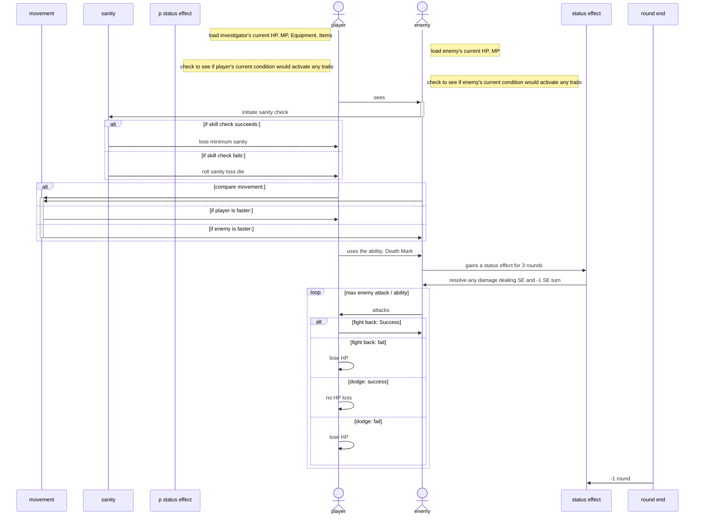

```mermaid 
    sequenceDiagram
    participant movement    
    participant sanity
    participant p status effect
    actor player
    actor enemy

    participant status effect
    participant round end


    note left of player: load investigator's current HP, MP, Equipment, Items
    note right of enemy: load enemy's current HP, MP
    note left of player: check to see if player's current condition would activate any traits
    note right of enemy: check to see if enemy's current condition would activate any traits


    player->>+enemy: sees
    enemy->>-sanity: initiate sanity check
    alt if skill check succeeds:
    sanity->>player: lose minimum sanity
    else if skill check fails:
    sanity->>player: roll sanity loss die
    end

    alt compare movement:
    player->>+movement: 
    enemy->>movement: 
    else if player is faster: 
    movement->>player: 
    else if enemy is faster:
    movement->>-enemy: 
    end

    player->>enemy: uses the ability: Death Mark
    enemy->>status effect: gains a status effect for 3 rounds

    status effect->>enemy: resolve any damage dealing SE and -1 SE turn

    loop max enemy attack / ability
    enemy->>player: attacks
    alt fight back: Success
    player->>enemy: 
    else fight back: fail
    player->>player: lose HP
    else dodge: success
    player->>player: no HP loss
    else dodge: fail
    player->>player: lose HP
    end
    end

    round end->>status effect: -1 round
```