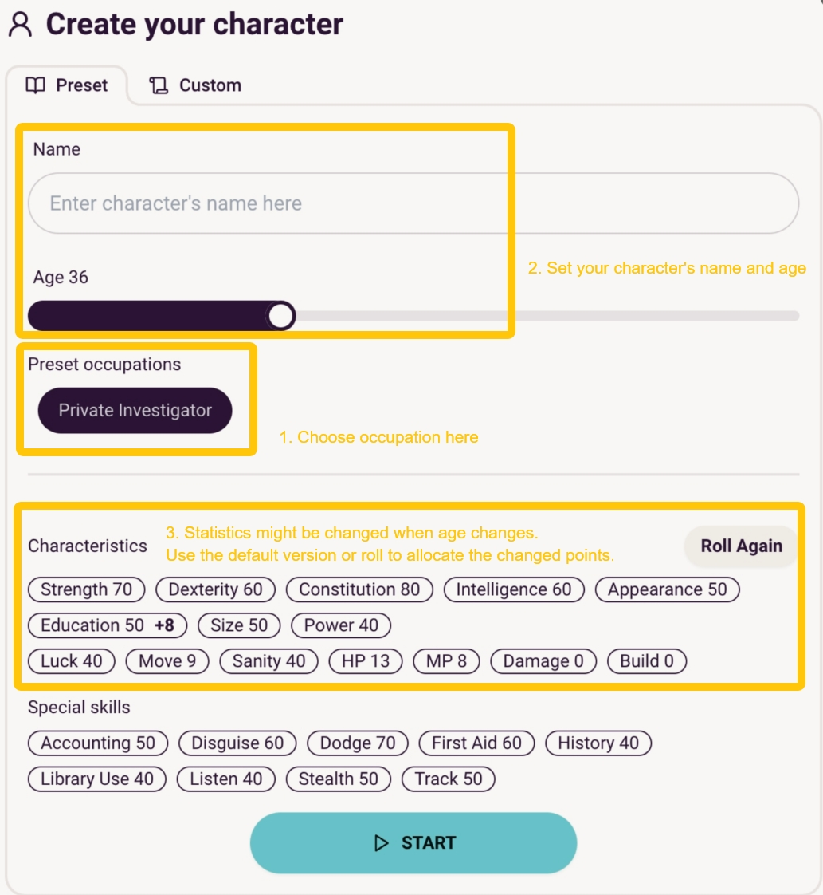

## Create a Character

Rolling Sagas provide you with two ways to create characters.

- ### Quick Start with Ready-made Characters

In ready-made characters, occupations and the related characteristics and skills have been preset. By simply choosing the occupation you want, you can quick start the game in 10 seconds. 

(以下会用视频替代)
{: style="width: 800px; height: auto; display: block; margin: 0 auto;" }

- ### Customize Your Own Character
 Wanna create a new occupation? Or modify existing occupations with different statistics? 

 That's what 'Custom' page is used for. 

Steps(会加图片说明):
1. Add occupation. 
2. Allocate characteristics and skill points. Secondary Attributes will be calculated automatically. 
3. Give your character a backstory.

Check *Call of Cthulhu: the 7th Edition* below if you'd like to know about the definitions and functions of  each part.
- [Occupations and Skills](occupations-skills.md#occupations-and-skills)
- [Characteristics](characteristics.md#characteristics)
- [Secondary Attributes](second-attributes.md#secondary-attributes)
- [Backstory, Gear and Possessions](backstory.md#backstory-and-Equipment)

