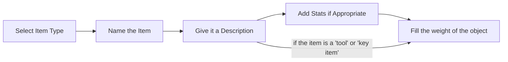

# Items & Equipment

Overview: There are always unique items and equipment in stories, like the Excalibur in Legend of King Arthur or the One Ring in Lord of the Rings. Our stories and adventure will also have items and equipment in which our players can discover, equip, or used to increase their survival chances or to solve a mystery in the chapter. As such, it is important to implement this mechanic properly.

## Items Library

Similar to *enemies*, we need a library for items. And due to the near infinite possibilities of the effect of each item, we will need to provide a large library for our players in which they can create new stories with.

This will include ID, NAME, DESCRIPTION, and STATS (including its corresponding roll). When needed, Creators can select whichever item they want to appear in their story.

```
(REVIEW)
Different items with different 'rules' should seperated into different table.
```

### Examples:

| ID: | Name: | Description: | Stat: | Type: | Weight:
:-- | :-: | :-: | :-: | :-: | --: |
001 | First Aid Kit | Great for attending all wounds, even the dying. | FIRST AID SKILL: CF: +0 HP, F: +1 HP, RS: +3 HP, HS: +4 HP, CS: +6 HP | Consumable | 0.5kg
002 | Flashlight | Lights up the dark. | - | Tool | 0.3kg
003 | Golden Chalice | A golden chalice adorned with beautiful jewels | - | Key Item | 0.6kg
004 | Sword | A well forged blade | 1D10 + DB | Equipment: Melee | 5kg
005 | Thick Leather Jacket | A well crafted leather jacket | 1 Armor Point | Equipment: Armor | 0.7kg

*Depending on the level of success of the item's corresponding skill, the effect of the item may be increased or decreased.*

### Weight: 

I have added weight in there for now, but I am unsure if we will need this function since there probably isn't much of a chance for the player's character to even carry so much stuff on them on 1 or 2 play through.

*Might be using **build** check instead for many instances.*

## Item Types:

As you can see, there are also different item types, each with a specific purpose behind it:

- Consumable: Are items that disappears after using. (Affects character stats and equipments)
- Tool: Items that can be used multiple time. (**can be used on the environment**)
- Key Item: Specifically for story purposes.
- Equipment/Brawl: Gives the player character a brawl weapon to use against enemy
- Equipment/Melee: Gives the player character a melee weapon to use against enemy
- Equipment/Firearms: Gives the player character a firearm to use against enemy
- Equipment/Armor: Gives the player character armor for better survival

```
REVIEW:
Maybe the equipment should seperate into "armor" and "weapon".
```

### Consumable:

Consumable items disappear from the player character's inventory after it's used. It is also important to note that consumable items can **alter** player stats **DURING** and **OUTSIDE** of battle. Meaning, a first aid kit can be used during combat, or after combat when they are relatively safer.

```
REVIEW:
Cosumable items need amount 'limitation'.(or how much the items can stack?)
```

### Tool:

Tools can only be used outside of battle, or, during **exploration**. As they are mainly designed to be used on the environment to invoke changes (e.g. light up a dark room with a flashlight).

```
REVIEW:
Can tools be stackable?
```

### Key Items:

As the name suggests, these are items that are important and quest/story related. They cannot be thrown away or disposed of.

### Equipment:

There are various types of equipments player's character can equip themselves with on the **inventory** screen:

- Firearms
- Melee
- Brawl Weapons (e.g. brass knuckle)
- Armor

Each of these equipments will affect the player's stats in one form or another. Equipping a specific type of weapon, for example, a melee weapon (sword) will give the player the **option** to **use** melee during combat. The same goes for firearms. Each weapon and armor will have their own attack stats etc.

*Note that the player can still choose to brawl if they wish to do so.*

```
REVIEW:
Armor and weapon has different rules, eg: weapon add extra damage, and armor increase some stats of player.
```


## Create your own Items

As always, we need to give the tools to the players to build their own items and equipment if they wish to do so. In that case, they will have to fill out the corresponding details of the item/equipment they wish to create.




### Creation Flow

Creators will first select the type of item to determine what its overall function is, then name it, describe it and apply appropriate stats depending on the item (e.g. dice rolled for weapons, or armor point for armor). Lastly, just fill in the weight for the object.

### Stat References


## Enemies

*This section is related to the **enemies.md** file under **battle_system** folder.*

Keep in mind that enemies drop items, and these items will **ALL** be coming from the **item library**.

---

# Inventory System

Overview: It is wonderful to find various items available in an adventure, but everyone will still need a place to store all those stuff somewhere. Thus, we have the **inventory system**. 

Not only does it help our player's character carry stuff in their imaginary backpack for future uses, it also has a limit designed to not over power these characters and take the fun out of the game (e.g. having 10 first aid kit).

## Weight Limit

This will be the inventory limit of a given character. This is calculated from their SIZE stat. 

- SIZE * 1.5(kg) * 20% = MAX carry Weight

- Thus, if a character has a SIZE of 70, that means their weight is 105 kg, and they can carry 21 kg.

When the player character exceeds this limit, they will not be able to progress through the story until they resolve the weight issue?

OR

When the player character exceeds this limit, the game will whisper to the AI and generate content based on that. And the player must resolve the weight issue before proceeding with the story?


## Item Category

Items will be separated into 3 different categories, which is reflected in the inventory presentation as there will either be multiple tabs or 3 separate box within a single screen (All depending on UX & UI design).

The 3 categories are:

- Consumables 
- Tools 
- Key Items

As the player amass more and more items, it would be easier to differentiate and utilize each of them.

*Another good benefit is that since certain items have unique functions, players can immediately know that every object in **tools** can be used to interact with the environment.*

### Item Description

Each item should have a short description for it. So we will need a small window for that.

*Do set a word limit for item description.*

### Tools

When player is on the **Tools** tab/window, there should be a "use" button when the object has been selected, or there is a use button on the side? Or drag the item to a use box? 

### Consumables

All items in the consumable section will have an item tally system denoted by a multiplication sign "x". 

- e.g. First Aid Kit x 4
- e.g. Water x 7 

For each and every use, the number of items would go down.

### Key Items

These items cannot be removed or dispose of by conventional means, and would only disappear when it is consumed in the story.


## Equipment

There will be a left hand (LH), right hand (R), and also centerpiece (CP). These are all slots that player character can equipment melee weapons, firearms, and armor.

- If any melee or firearms are equipped, it would directly influence the **attack options** of the character.

- If any armor is equipped, it would directly influence the amount of damage received. 
---

```mermaid
classDiagram
    class Inventory{
    +Store Items
    +Store Equipment
    +Use/throw Items()
    +Equip/throw equipment()
    }

    class Items{
    +Consumables
    +Tools
    +Key Items
    +Environmental Interaction()
    +Character Interaction(e.g. First Aid Kit)
    }

    class Weight{
    +kg
    +MAX Carry Weight
    +Player movement()
    +Player story progression()
    }

    class Equipment{
    +LH [Left Hand]
    +RH [Right Hand]
    +CP [Centerpiece]
    +Modify attack choices()
    +Modify damage received()
    }


Inventory <|-- Items
Inventory <|-- Equipment
Inventory <|-- Weight
