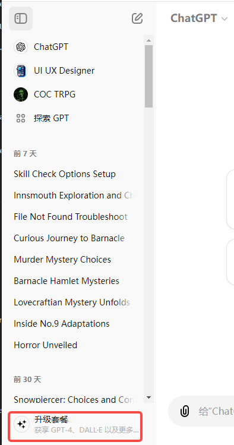
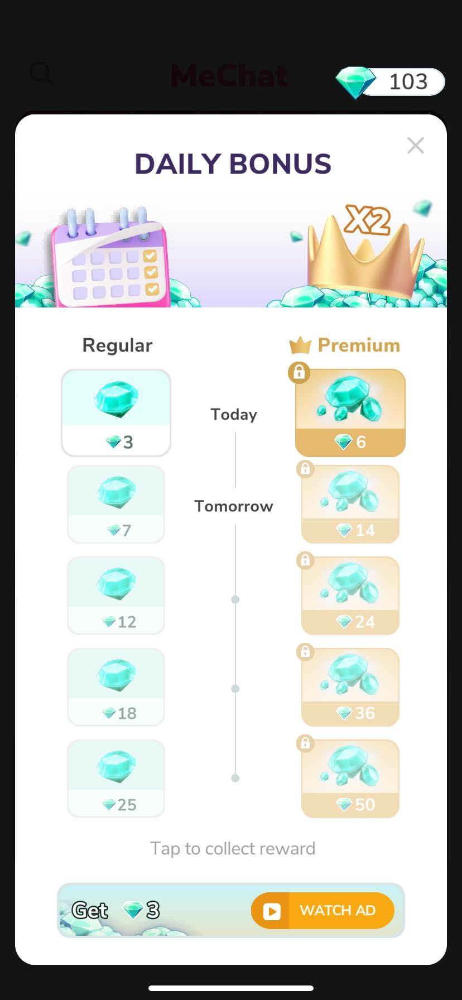
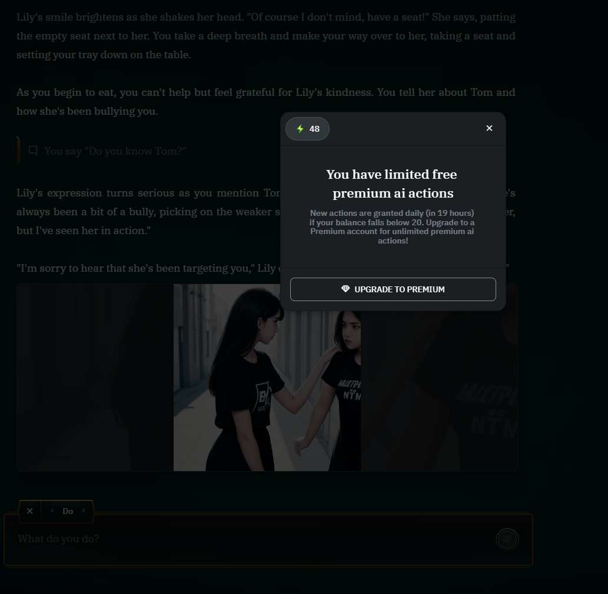
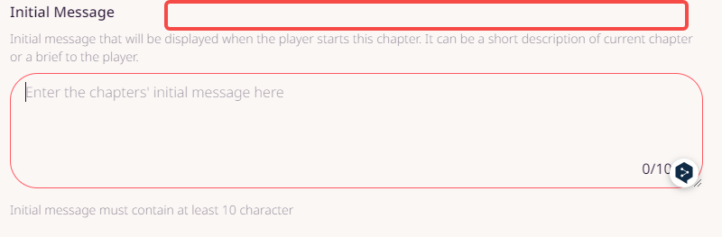
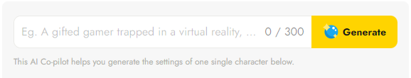
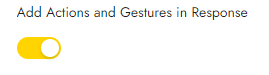
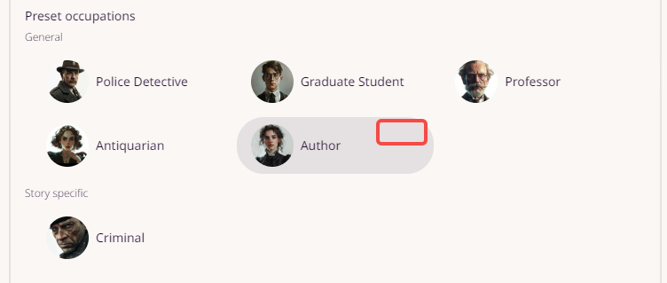
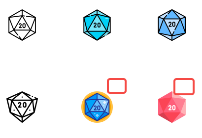
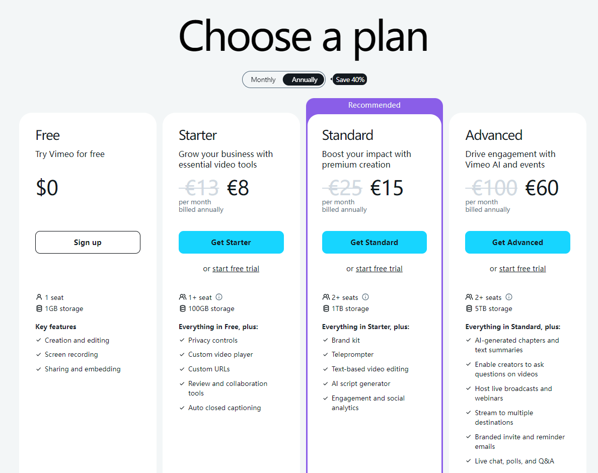
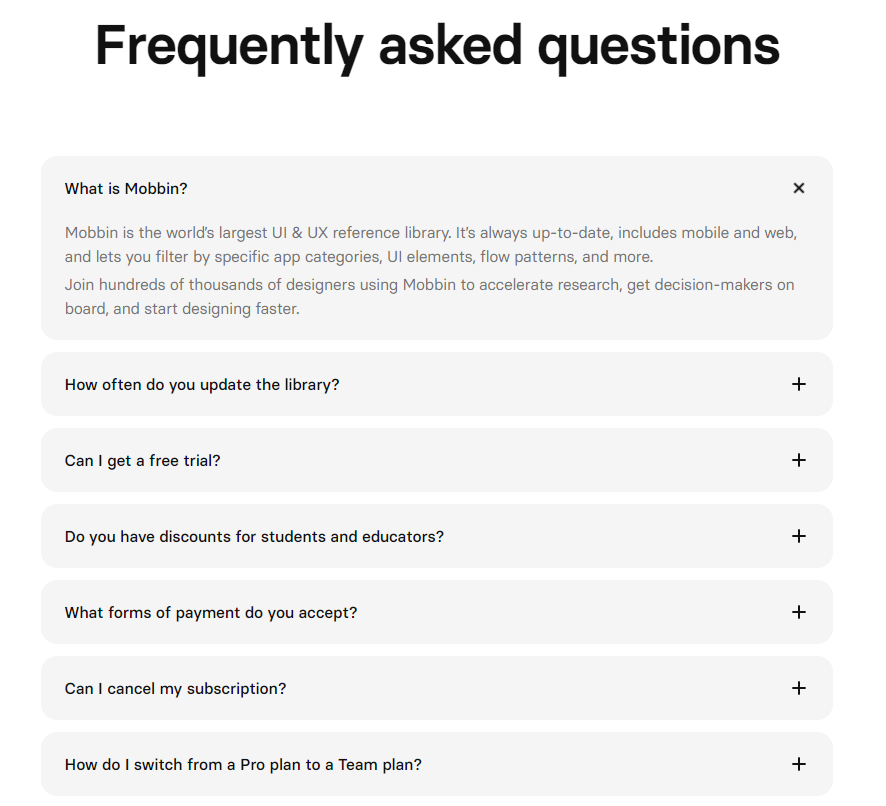

# Monetization Strategy 

## Overview
These files shows a research on the monetization strategies of AI-assisted story creation platforms, and RS' monetization stragey which refers to those existing platforms.

## Research
**AI Story Creation Platforms (Click to find details):**
- [AI Dungeon (mainly)](ai-dungeon/ai-dungeon.md)
- [NovelAI](novelai/novelai.md)
- [DreamGen](dreamgen/dreamgen.md)

To sum up, main subscribed services of them are:
1. access to more text and image AI models
2. longer token length
3. more AI generation uses
4. more advanced memory functions (AI Dungeon to be specific)

But how they provide these services are different. I left comments below.

| Product      | Subscription Tier | Monthly Price | Features                                                                                         | Comments                                  |
|--------------|-------------------|---------------|-------------------------------------------------------------------------------------------------|-------------------------------------------|
| **AI Dungeon**   | Free              |               | - 2 Story Generators (Up to 2k token context) - 1 Image Generator (cost Credits) - 0 Memories - 0 Monthly Credits | One big difference is that AI dungeon's free users can also have unlimited access to text AI models, as long as they use the **basic text AI models**.  Their Credits are used to generate images mainly.  Their core paid service for now is their Memory System and token context. |
|              | Adventurer        | $9.99         | - 3 Story Generators (Up to 4k token context) - 2 Image Generators - Memory System - 25 Memories - +480 Monthly Credits |  |
|              | Champion          | $14.99        | - 3 Story Generators (Up to 8k token context) - 2 Image Generators - Memory System - 50 Memories - +760 Monthly Credits |    
|              | Legend            | $29.99        | - 4 Story Generators (Up to 16k token context) - 4 Image Generators - Memory System - 100 Memories - +1650 Monthly Credits |       |
|              | Mythic            | $49.99        | - 4 Story Generators (Up to 32k token context) - 4 Image Generators - Memory System - 200 Memories - +2750 Monthly Credits |       |
| **NovelAI**      | Paper            | Free          | - 100 free text generations - 100 free TTS generations - 6144 tokens of memory                     | Free users have access to all text models, though with limited use.  Voice model is available.  No access to image models.         |
|              | Tablet            | $10           | - Unlimited text and TTS generations - 3072 tokens of memory - 1000 Anlas (in-game resource) for image generation and custom AI module training |       |
|              | Scroll            | $15           | - Unlimited text and TTS generations - 6144 tokens of memory - 1000 Anlas for image generation and custom AI module training |            |
|              | Opus              | $25           | - Unlimited text and TTS generations - 8192 tokens of memory - Longer output generation - Exclusive access to experimental AI models - Unlimited image generation |  |
| **DreamGen**     | Free              |               | - 100 credits limit per month   - 15 extra daily credits generations                                                                            | Credits is calculated into tokens, instead of generation times.  Subscription basically means more credits and increase token context limit.           |
|              | Starter          | $7.83         | - 200 credits limit per month  - 20 extra daily credits  - 4000 tokens context limit                                         |  |
|              | Advanced         | $19.35        | -1500 credits limit per month  - 50 extra daily credits  - 8000 tokens context limit                  |           |
|              | Pro              | $48.30        | -3500 credits limit per month  - 100 extra daily credits  - 12000 tokens context limit                | |

**Other AI products:**
- [Suno](https://suno.com/account)

| Plan       | Price        | AI Credits | Usage Type       | Generation Queue | Running Jobs | Features                                                                                       |
|------------|--------------|------------|------------------|------------------|--------------|------------------------------------------------------------------------------------------------|
| Free       | $0           | 50/day     | Non-Commercial   | Shared           | 2 at once    | Basic AI interaction, unlimited games, multiplayer access, 1 AI opponent level, access to strategies|
| Pro        | $8/month     | 2.5k/month | General Commercial | Priority         | 10 at once   | Enhanced AI interaction, ad-free experience, 3 AI opponent levels                                 |
| Premier    | $24/year     | 10k/month  | General Commercial | Priority         | 10 at once   | Premium AI engagement, priority support, exclusive avatars, custom game rules, highest priority generations |

- [Midjourney](https://docs.midjourney.com/docs/plans)

| Feature                           | Basic Plan    | Standard Plan   | Pro Plan       | Mega Plan      |
|-----------------------------------|---------------|-----------------|----------------|----------------|
| Monthly Subscription Cost         | $10           | $30             | $60            | $120           |
| Annual Subscription Cost          | $96 ($8/month)| $288 ($24/month)| $576 ($48/month)| $1152 ($96/month) |
| Fast GPU Time                     | 3.3 hr/month  | 15 hr/month     | 30 hr/month    | 60 hr/month    |
| Relax GPU Time                    | -             | Unlimited       | Unlimited      | Unlimited      |
| Purchase Extra GPU Time           | $4/hr         | $4/hr           | $4/hr          | $4/hr          |
| Work Solo In Your Direct Messages | ✓             | ✓               | ✓              | ✓              |
| Stealth Mode                      | -             | -               | ✓              | ✓              |
| Maximum Concurrent Jobs           | 3 Jobs        | 3 Jobs          | 12 Fast Jobs   | 12 Fast Jobs   |
|                                   | 10 Jobs queue | 10 Jobs queue   | 3 Relaxed Jobs | 3 Relaxed Jobs |
|                                   |               |                 | 10 Jobs queue  | 10 Jobs queue  |
| Rate Images to Earn Free GPU Time | ✓             | ✓               | ✓              | ✓              |
| Usage Rights                      | General Commercial Terms* | General Commercial Terms* | General Commercial Terms* | General Commercial Terms* |

- [Luma](https://lumalabs.ai/dream-machine/account)

| Plan      | Price*    | Generations per Month            | Priority Generations    | Commercial Use      | Remove Watermark   |
|-----------|----------|----------------------------------|-------------------------|---------------------|--------------------|
| Free      | Free     | 30 generations per month         | -                       | No                  | No                 |
| Standard  | $29.99   | 120 (+30) generations per month  | High priority           | Yes                 | Yes                |
| Pro       | $99.99   | 400 (+30) generations per month  | Highest priority        | Yes                 | Yes                |
| Premier   | $499.99  | 2,000 (+30) generations per month| Highest priority        | Yes                 | Yes                |

Yearly subscription all get 20% off discount.

## RS Monetization Plan
Since RS is at the beginning stage, let's make it simple and straightforward.
### In-Game Reource
To simplify, we only have one in-game resource called **Credit**. 

It is consumed in:
- text generation. Every time GPT generate new content(**cache will NOT cost credit**), which is when user make a choice, do a skill check, or regenerate, cost 1 Credit. 

**Error will NOT cost credit (use programme to detect). Players can report bugs if the detection itself has error.**

- image generations (avatar, background image). Cost 2 credits per time. Video generation, 5 credits.
~~- users roll a dice to determine their character stats or descriptions. Every time users rolling a dice cost 1 Credit.~~
- tip the creator you like. Users can select how much credits they want to tip. Creator can gain the credits for their own use. 

How to Get it:
- VIP users will receive their credits at the beginning of every month. 1st of every month.
- Daily Login. 10 credits for free users. Double credits for subscribers.
~~- Users can purchase additional credits.~~ (Not now)

In AI Dungeon, 1 Credit cost 0.0125 dollars. One image cost 1 credit.
In NovelAI, 1 Anlas cost 0.0024 dollars, but one image cost 20 anlas. same value equals to 0.048 dollars.
In DreamGen, 1 Credit cost 0.0129 dollars. 

Since our Credit has more uses than AI Dungeon, I think we can set higher prices for credits than AI Dungeon. Increase price by 50%.

| Credits | AI Dungeon Price per month   | RS Price per month  |
|---------|---------           |--------  |
| 80      | $0.99              | $1.49    |
| 500     | $4.99              | $7.49    |
| 1200    | $9.99              | $14.99   |
| 2500    | $19.99             | $29.99   |
| 6500    | $49.99             | $74.99   |
| 14000   | $99.97             | $149.96  |

### Membership

#### Full pricing plan (discussed with Aspirin on Jul 15th)

| Tier       | Monthly Price          | Features                                            |
|------------|----------------|----------------------------------------------------|
| Free       | 0              | - 50 free credits for visitors. Extra 50 credits if visitors register accounts. Daily login 10 credits.   - Access to GPT 4o, image and video generators   - AI assisted game writing  ~~- Writers can create 10 Chapters at most, 10 turns and 10 rules at most per chapter.~~   |
| Standard       | $10            | - 700 credits per month. Daily login 20 credits.   - Access to GPT 4o, image and video generators   - AI assisted game writing  ~~- Writers can create 15 Chapters at most, 12 turns and 15 rules at most per chapter.~~ ~~- Writers have access to AI generated initial message, chapter rules(skill checks, chapter gending).~~  ~~- Writers have access to create own enemies and items (free accounts can only use templates).~~   ~~- Players can have extra* level up points for characters.   - Players have access to custom weapons and items they want to take.*~~   - Players have access to premium occupations.*   - Players have access to fancier dice.   - Ads free. |
| Pro       | $15            | ~~- 1000 credits per month. Daily login 20 credits.~~ Unlimited credits.   - Access to GPT 4o, image and video generators   - AI assisted game writing   ~~- Writers can create 18 Chapters at most, 16 turns and 18 rules at most per chapter.~~~~ - Writers have access to AI generated initial message, chapter rules(skill checks, chapter gending).   - Writers have access to create own enemies and items (free accounts can only use templates).  ~~ ~~- Players can have extra* level up points for characters.  - Players have access to custom weapons and items they want to take.*  ~~ - Players have access to premium occupations.*   - Players have access to fancier dice.   - Ads free.|

**AI assisted game writing: All users can use AI to generate initial messages, chapter rules, skill checks. Only need to spend credits, maybe cost 5 credits every time.**
**All users can create new boss and custom their stats.**
**All users can custom their own character while playing, but we'll provide some premium characters only accessible for VIPs. (wait for Aspirin's decision)**

#### Discount
Users who subscribe 6 month altogether can have a 10% discount. 12 month altogether have 15% discount. 

#### Membership Trial   
A one-week trial is offered. If user cancels during the trial period, the premium benefits will end at once.

#### Membership Exposure
##### 1. Home page

Position: at the buttom left, similar to ChatGPT
After user click, directly jump to the monetization webpage.

##### 2. Daily Login rewards
Free vs VIP
Daily login will pop up the first time user opens the home page every day. Pro users don't have the pop up cuz they already have unlimited credits. 

##### 3. Player runs out of credit while playing in the story

Every time AI generates new content (which is when player make a choice, do a skill check, or player regenerate), cost 1 Credit. 
Position: When player runs out of credit while playing, a window pops up, telling 'You've run out of credits. Upgrade to a Premium account and continue your journey!' A button 'Upgrade to Premium' at the bottom. 
After user click, directly jump to the monetization webpage.

##### 4. Besides remaining credits 
Position: wherever user can check their remaining credits, e.g. profile page. Besides the remaining credits, there's a 'Unlock unlimited credits' button. After user click, directly jump to the monetization webpage.

##### 5. Ads free
If user click to close the image ads or turn off the video ads, jump to the monetization page. It depends on if it's image ad or video ad.

According to our subscription, membership will also appear where subscribed service are provided: 
##### 6. Creator editing chapter page  

Have an AI generate button/column besides the initial message. The button has a premium logo on it to let users know it's a paid function. After user click, directly jump to the monetization webpage.

Besides the chapter rule, there's a button 'Add some skill check by AI'. If user click on, directly jump to the monetization webpage.

##### 7. Play mode, select characters. Premium occupations, with a premium logo on it. Player can click to see the occupation, but if player clicks the 'Start' game, jump to the monetization page.

##### 8. Fancier Dice
On the playing story page, together with the check occupation button, share my adventure button, there's a 'dice' button. Some dice are free, but some are premium.   

#### Current Subscription Plan (based on current features)
Includes:
- [Subscription page](#subscription-page)
- [Ways to enter subscription page](#ways-to-enter-subscription-page) 

##### Subscription Page
Subscription有一个单独的网页，会有多个入口链接到该网页。
Subscription Page包含：Free, Standard, Pro 三种等级user的权益和定价，以及Subscription相关的FAQ

| Free                                    | Standard                                      | Pro                                 |
|-------------------------------------------------------------------------------------------|------------------------------------------------------------|-------------------------------------|
| Free                                     | $10 per month                                              | $15 per month                       |
| - 50 free credits for casual browsers. Extra 50 credits for registered users. Daily login rewards*. | - 700 credits per month. Daily login rewards double.      | - Unlimited credits.                |
| - Access to GPT-4o                                                 | - Access to GPT-4o                                        | - Access to GPT-4o                  |
|                                                                                           | - Early access to upcoming functions.                          | - Early access to upcoming functions.    |

基于现有产品，在full pricing plan上做了削减，现阶段三个等级主要还是在于credit数量的差别，后面等功能多了再加其他权益。

样式参考下图，
- 分成Free, Standard, Pro三列，每列包含Tier名称，价格和features（即上面图表里的信息），以及Free, Standard, Pro列分别加button: Free 'Try now', Standard 'Upgrade to Standard', Pro 'Upgrade to Pro'。
'Try now'点击后跳转到Home页面，如果是没有注册的用户，跳转到Home页面后，需要立即跳一个login页面引导TA注册。
'Upgrade to Standard'和'Upgrade to Pro'跳转到支付页面，如果该user没有注册或没有登录，需要先让TA login。
- 在Pro列加类似参考图里的Recommended边框，引导user选这个等级，文案使用'Best Value'。

- 像参考图一样分成Annually和Monthly，user可以点击查看年付和月付的价格，不过打开Subscription网页时默认在Annually（因为希望user选annually）。Annually即一次性买12个月，有85折优惠，做成原价划掉打折的效果，Standard 原价$120 Yearly $102, Pro 原价$180 Yearly$153

- standard和pro plan订阅后自动续订，在下一次扣款前3天提醒user

*由于现阶段只是credit数量的差别，不涉及功能上的区别，所以不设置one-week free trial*

**Frequently Asked Questions** 

目前先在Subscription page下面放FAQ，以后guide齐全了，可以在这个page放链接跳转到guide中FAQ的地址，和ChatGPT一样。

样式参考下图，每个question右侧有个按钮，点击直接可看到answer，不用跳转至新网页 https://mobbin.com/pricing

FAQ list：
- What is Credit? 
Credit is an in-game resource in Rolling Sagas used for generating new content with GPT-4o during gameplay. Each content generation costs 1 credit.

- When do I receive my Credits for a Subscription? 
Credits are granted after successful payment of your chosen subscription. If you sign up for a 12-month plan, you will receive the entire allotment of credits at the beginning of your subscription, rather than on a monthly basis.

- Can I transfer my Credits to others? 
Credits are tied to your account and are non-transferable.  

- How do I switch from Standard tier to Pro tier? 
Simply upgrade your plan and complete the payment for the Pro plan. The Pro tier benefits will take effect immediately after the payment is processed.

- How to cancel my subscription? 
Your subscription renews automatically based on the frequency specified on your subscription page (or monthly if not specified). To cancel, go to the subscription settings on your Profile page. Your cancellation will take effect at the end of the current subscription period.

- How do I request a refund? 
Refunds are not available for monthly subscriptions. However, users who purchase a 12-month subscription can request a refund within 3 days of purchase. Please contact us at support@rollingsagas.com.

More questions? Contact us at support@rollingsagas.com

PS. 自动续订和退款之后会正式做成policy放在guide网页，链接过去
##### Ways to enter subscription page 
[Check here](#membership-exposure)
先做1-4: Home Page, daily login rewards, 游玩过程中credit花完，和profile查看credit余额这4种情况  

#### Achievements & Rewards
*Not going to dig into this part for now, just to write down some ideas for future design.*

- First day playing 30 minute, for example, 30 credits.
- Play 10 hours in total

- Finish 1 story 
- Finish 5 stories

- Create 1 story

- Invite friends. After they sign up, both you and your referrals will receive 50 credits. 

- Beat XX Enemies