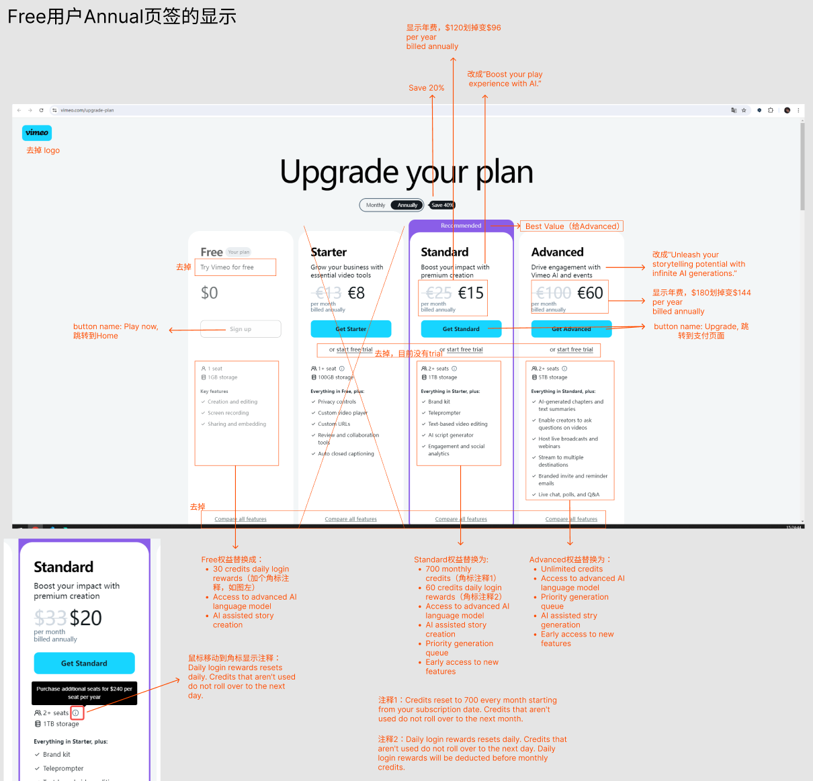
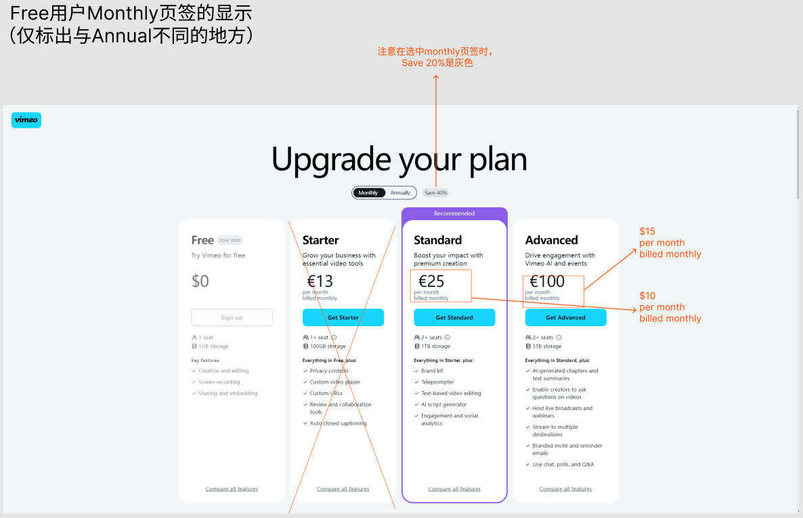
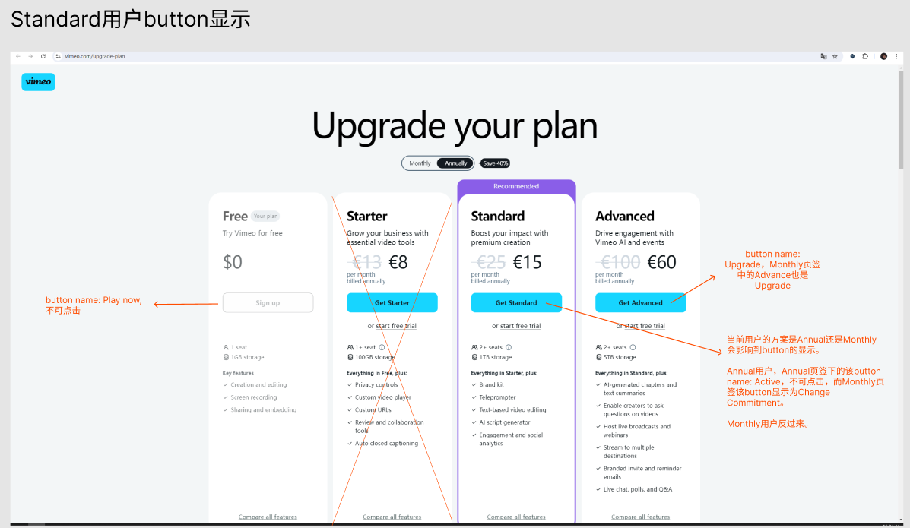
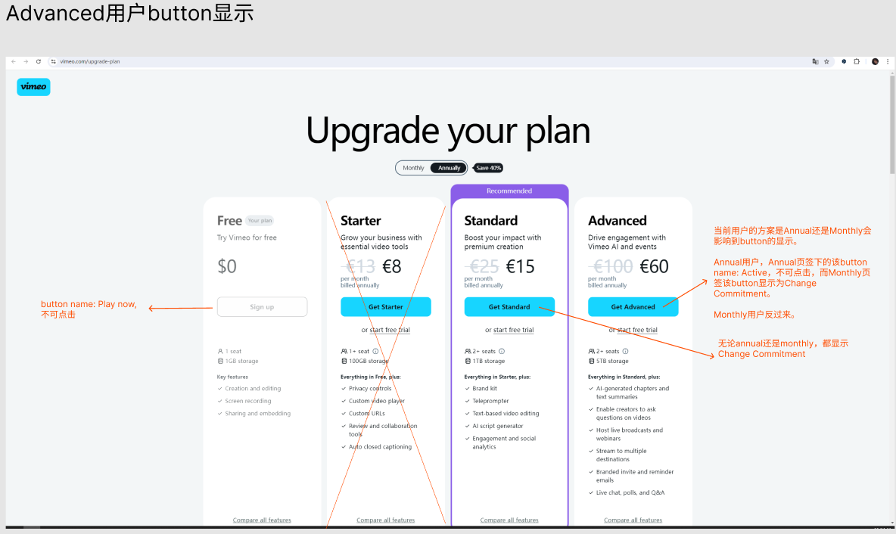
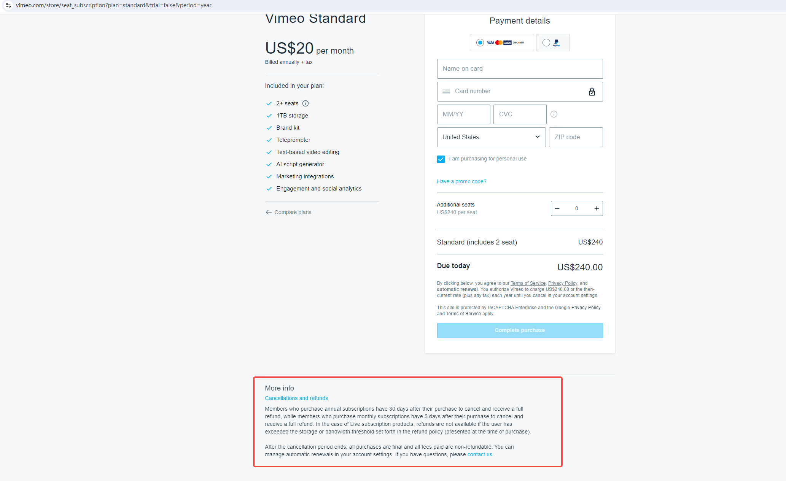
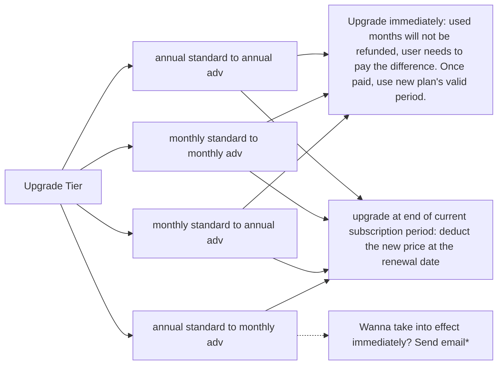
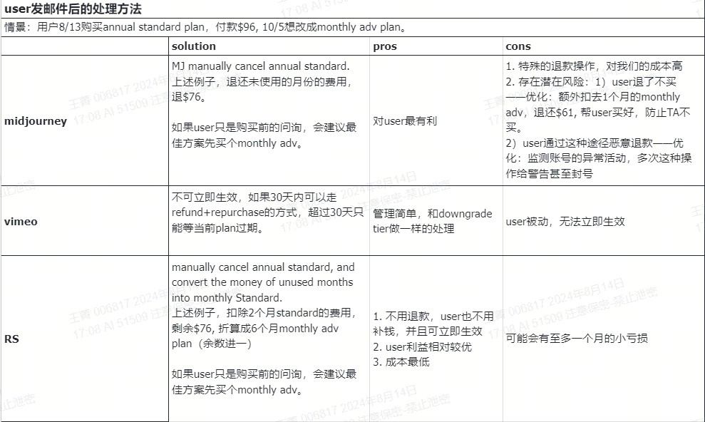
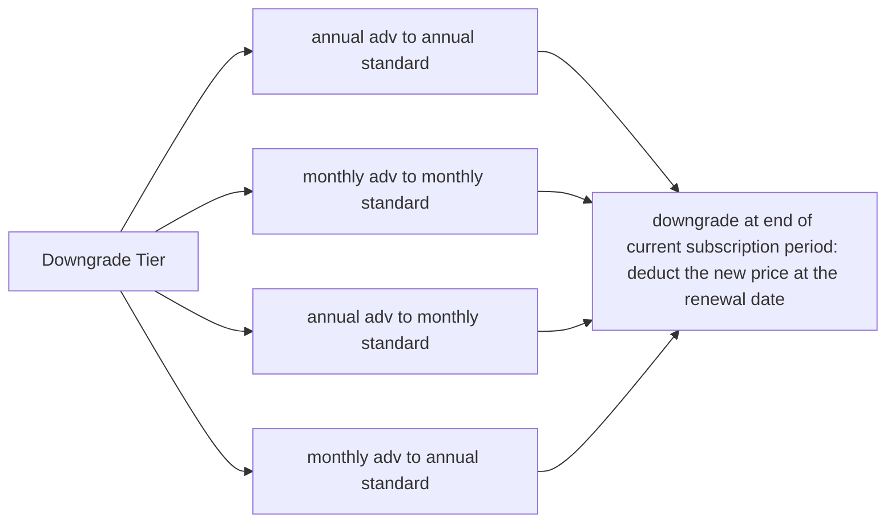
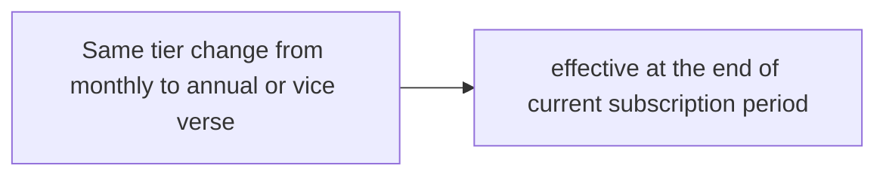
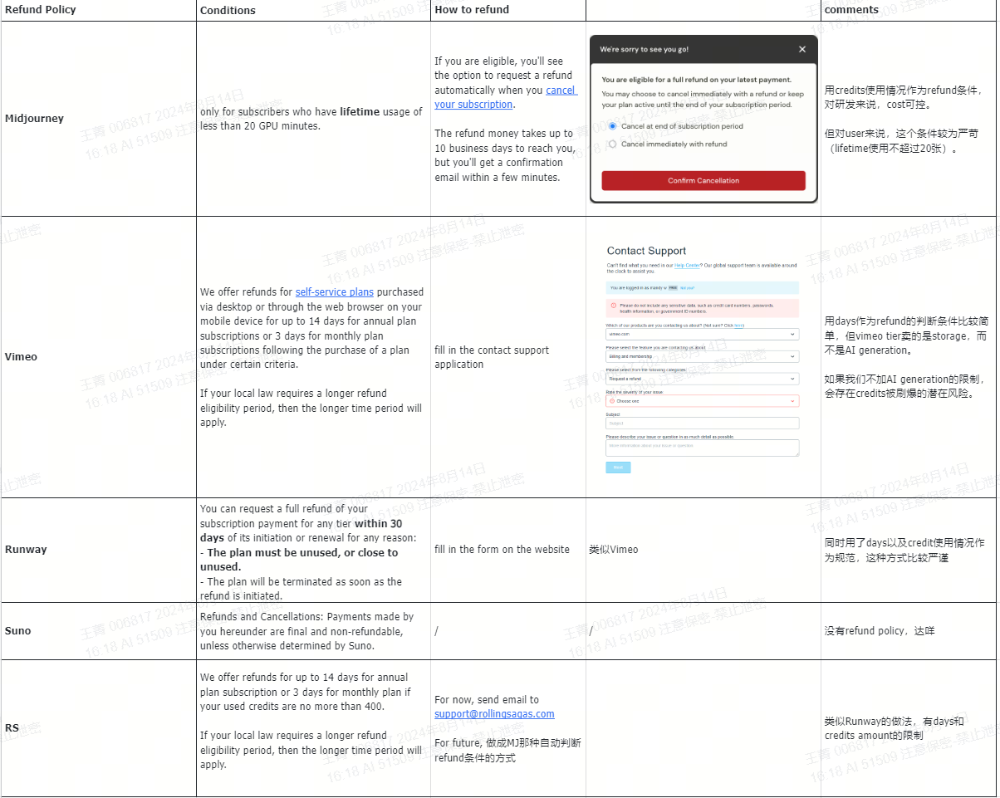

# Subscription Plan Page Design
 
 
 
 

文字备份

参考 [Vimeo](https://vimeo.com/upgrade-plan)
- Tier名称目前为Free，Standard和Advanced。 
其他参考： 
[ChatGPT](https://chatgpt.com/#pricing): Free, Plus 
[Midjourney](https://www.midjourney.com/checkout/plans?hash=be96d15e0742cef72e6cc2396a7d108c60349e6c46a425b55aec6c22770db0e9a69126ccef2d2164f1a9ddd1334b37fdPdnDmhUTSN8tFYzWAlVqfywbiPwqugW0YScB2ttUkY7O35aDci8irrv2snvjDmm1Y1fYgjpN604CwI9mqGUiaPvQ24ZXU0AVjU7rpUjfJJV8h2hOVdjQMe0E4vXyz0V9MunYdv6Dz/BGc0XwVf6lpXE7oV2uukjYGbEypcaswP8UebSb%20c3BQNql1X7yf3X9EoPiix2GFeYYutnOyCC3tdnSSGPYvsPuufa0s6LI066loQd3vCxsH4Xbf1TWsEbipb7F/9sDwOIbDWqLG9MErGLnFu0O5T4TwCP2hnscfCs=): Basic (paid), Standard, Pro, Mega   
[Suno](https://suno.com/account)：Basic (free), Pro, Premier  
[Runway](https://app.runwayml.com/video-tools/teams/mandywangwwwe/dashboard)：Free, Standard, Pro, Unlimited, Enterprise 

- 在这个页面不放FAQ了，拆到各个合适的地方。 
1. credits相关解释，用角标注释的方式，鼠标移上去会显示注释。 
2. Cancel和Refund参考vimeo，放在支付页面。文案用我们原来的。[vimeo支付页面](https://vimeo.com/store/seat_subscription?plan=standard&trial=false&period=year)
 
3. Switch plan的阐述，放到user实际点击button时，见下。

# Switch Plan

[Check design and full workflow here](https://www.figma.com/design/nhUeWK24dm4vYdJoZ36nfS/Subscription-Page?node-id=0-1&t=TE62Dp1PocmNQ0WV-0)

**General Rule** 
For upgrade tier, user can choose whether to upgrade immediately with proration or upgrade at the end of the current subscription period.

For downgrade tier, user can only downgrade at the end of current subscription period.  

**Upgrade参考Vimeo和Midjourney**

 
最后一种情况比较特殊，网页上没有立即生效的选项，只有下个周期生效。User如果想要立即生效，需要发邮件特殊处理： 

 

**Downgrade参考[Vimeo](https://help.vimeo.com/hc/en-us/articles/12425416895249-Downgrade-your-subscription)，[Midjourney](https://docs.midjourney.com/docs/plans)，[Suno](https://suno-ai.notion.site/Subscriptions-f33c81dcee7a4069986e737b4b0dcc36)，[Runway](https://help.runwayml.com/hc/en-us/articles/21664961171475-Which-plan-is-right-for-me), 一律是当前plan到期后生效。同一等级付款频次的变化，也是在当前plan到期后生效。**

# Refund Policy

