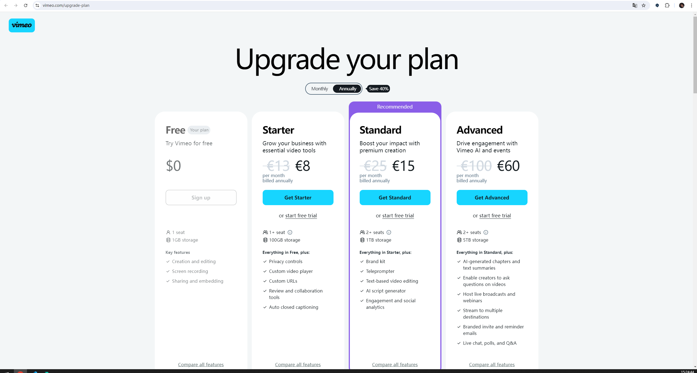
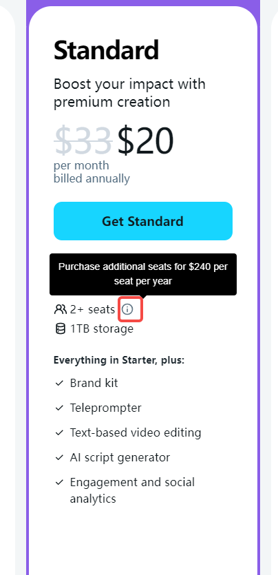
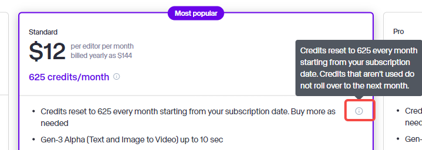
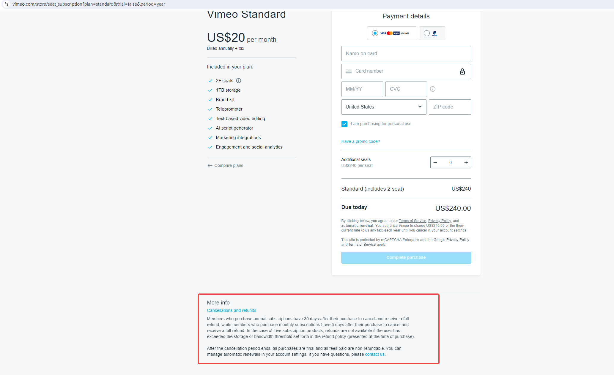
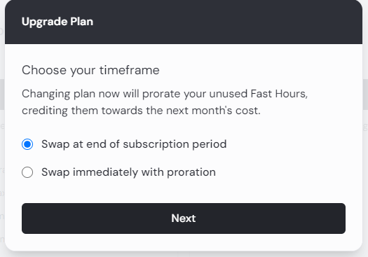
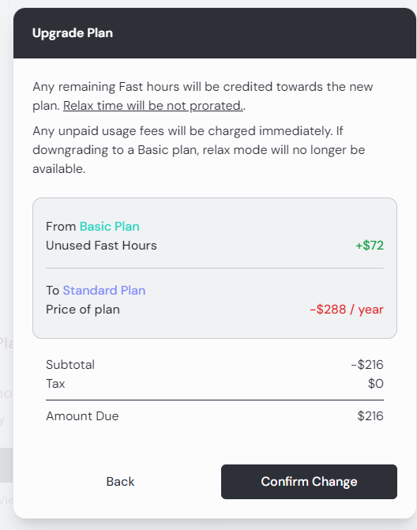
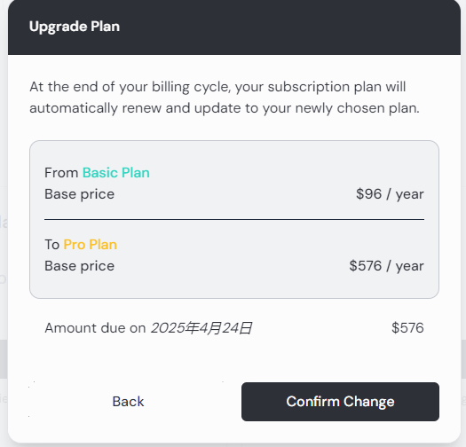
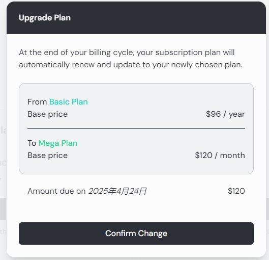

# Reference
参考 [Vimeo](https://vimeo.com/upgrade-plan)

- 付费方案单独一个网页，撑满当前页面。
- 顶部文字参考vimeo，Upgrade your plan
- Monthly和Annually Save 20%的button按钮效果都按照vimeo的设计来。
- Tier名称目前为Free，Standard和Advanced。 
其他参考： 
[ChatGPT](https://chatgpt.com/#pricing): Free, Plus 
[Midjourney](https://www.midjourney.com/checkout/plans?hash=be96d15e0742cef72e6cc2396a7d108c60349e6c46a425b55aec6c22770db0e9a69126ccef2d2164f1a9ddd1334b37fdPdnDmhUTSN8tFYzWAlVqfywbiPwqugW0YScB2ttUkY7O35aDci8irrv2snvjDmm1Y1fYgjpN604CwI9mqGUiaPvQ24ZXU0AVjU7rpUjfJJV8h2hOVdjQMe0E4vXyz0V9MunYdv6Dz/BGc0XwVf6lpXE7oV2uukjYGbEypcaswP8UebSb%20c3BQNql1X7yf3X9EoPiix2GFeYYutnOyCC3tdnSSGPYvsPuufa0s6LI066loQd3vCxsH4Xbf1TWsEbipb7F/9sDwOIbDWqLG9MErGLnFu0O5T4TwCP2hnscfCs=): Basic (paid), Standard, Pro, Mega   
[Suno](https://suno.com/account)：Basic (free), Pro, Premier  
[Runway](https://app.runwayml.com/video-tools/teams/mandywangwwwe/dashboard)：Free, Standard, Pro, Unlimited, Enterprise 

- Tier name下面的宣传语，如果有必要放的话，Standard和Advanced可以分别突出丝滑的play experience和无限制的create experience。 
Standard: "Boost your play experience with AI." 
Advanced: "Unleash your storytelling potential with infinite AI generations.", "Essential for mastering AI story creation." 
- Annual plan的价格，全额显示和月度显示都可以。
- 每列的button，这里涉及到不同tier的用户需要显示不同的button，参考的[Midjourney](https://www.midjourney.com/checkout/plans?hash=be96d15e0742cef72e6cc2396a7d108c60349e6c46a425b55aec6c22770db0e9a69126ccef2d2164f1a9ddd1334b37fdPdnDmhUTSN8tFYzWAlVqfywbiPwqugW0YScB2ttUkY7O35aDci8irrv2snvjDmm1Y1fYgjpN604CwI9mqGUiaPvQ24ZXU0AVjU7rpUjfJJV8h2hOVdjQMe0E4vXyz0V9MunYdv6Dz/BGc0XwVf6lpXE7oV2uukjYGbEypcaswP8UebSb%20c3BQNql1X7yf3X9EoPiix2GFeYYutnOyCC3tdnSSGPYvsPuufa0s6LI066loQd3vCxsH4Xbf1TWsEbipb7F/9sDwOIbDWqLG9MErGLnFu0O5T4TwCP2hnscfCs=) 
未订阅用户：free plan显示Play Now，点击跳转至Home，Standard和Advanced列显示Upgrade，点击跳转到支付页面。 
Standard用户：当前方案显示Active，不可点击，Advanced列显示Upgrade，Free plan无button。 
Advanced用户：当前方案显示Active，不可点击，Standard列显示Change Commitment, Free plan无button。 

- Best Value为Advanced plan。
- 目前没有设置trial，考虑到目前没有功能上的区别。
- 权益不用加"Everything in Starter, plus:"，或者将credits单独拿出来，避免歧义。
- 底部的Compare all features不用放，因为我们现在只有credits数量的区别。

- 关于FAQ，在付费方案页面不放FAQ了，拆到各个合适的地方。 
1）credits相关解释，使用下图角标的方式来注释，鼠标移上去会显示注释。 
 

 

文案： 
在Free列daily login rewards旁增加角标，内容：Daily login rewards resets daily. Credits that aren't used do not roll over to the next day. 

在Standard列的700 credits per month旁增加角标，内容： 
Credits reset to 700 every month starting from your subscription date. Credits that aren't used do not roll over to the next month.  

在Standard列daily login rewards旁增加角标，内容： 
Daily login rewards resets daily. Credits that aren't used do not roll over to the next day. Daily login rewards will be deducted before monthly credits. 

2) Cancel和Refund参考vimeo，放在支付页面。文案用我们原来的。[vimeo支付页面](https://vimeo.com/store/seat_subscription?plan=standard&trial=false&period=year)

3) switch plan

何时生效，费用清算，在user点击upgrade后的页面显示。这里参考的Aspirin midjourney的switch plan页面。 

user要升级plan时，可以选择立即升级或是在下一次扣费时升级。 

点击立即升级后，会跳出结算页面，给TA自动计算差价，让user明确知道要补多少钱，见下图。 

点击下个付款周期升级，也会告知价格的变化，并让user confirm。 

Annual plan变更为monthly plan都是在下个付款周期时更改，不能在当前周期内更改。 

