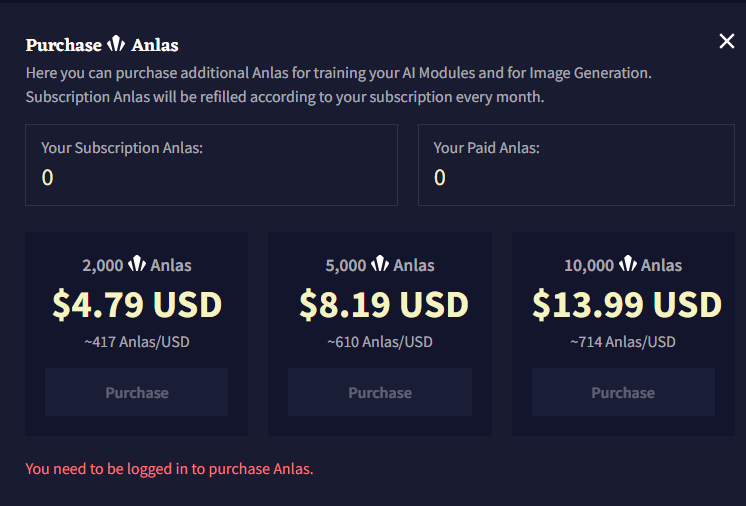

# NovelAI
## Overview
[NovelAI](https://novelai.net/) is an AI-assisted writing platform, on which users can write stories and enjoy text adventures.

The text adventure mode is just like AI Dungeon. Users can input actions to intereact with AI.

However, the created stories can't be 'played'. From my point of view, it's more like a self writing platform than a game play platform.

## Subscription
| Subscription Tier | Monthly Price | Features                                                                                          |
|-------------------|---------------|---------------------------------------------------------------------------------------------------|
| **Paper**         | Free          | - 100 free text generations - 100 free TTS generations - 6144 tokens of memory              |
| **Tablet**        | $10           | - Unlimited text and TTS generations - 3072 tokens of memory - 1000 Anlas for image generation and custom AI module training |
| **Scroll**        | $15           | - Unlimited text and TTS generations - 6144 tokens of memory - 1000 Anlas* for image generation and custom AI module training |
| **Opus**          | $25           | - Unlimited text and TTS generations - 8192 tokens of memory - Longer output generation - Exclusive access to experimental AI models - Unlimited image generation without Anlas cost (specific conditions apply) |

Anlas: NovelAI's in-game resource, used for generating image(1 image cost 20 Anlas.) and training AI models.

Anlas can be obtained by subscription or users can purchase Anlas alone. 

