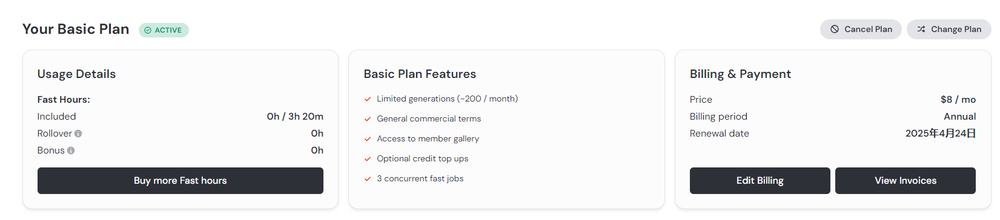
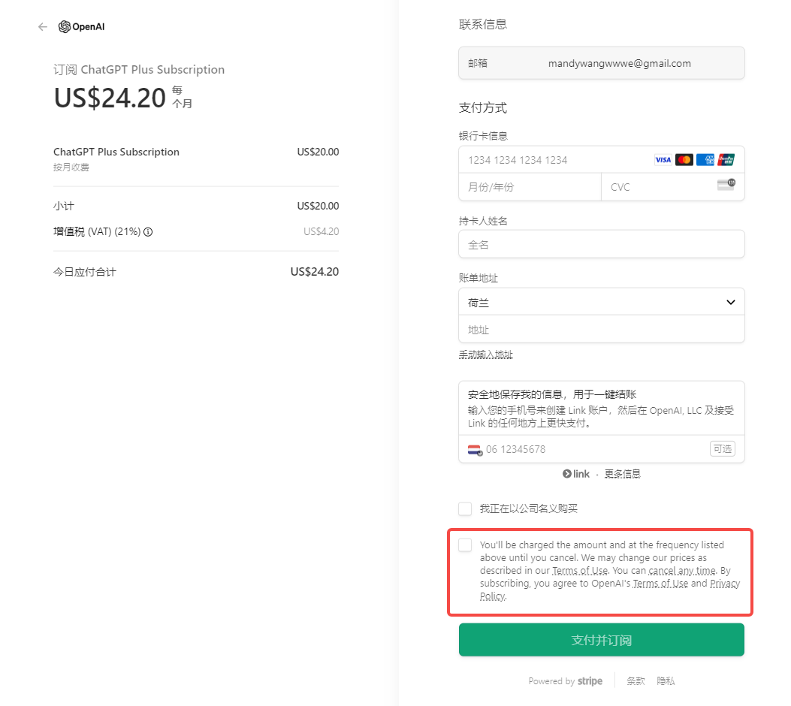

# Current Subscription Plan (based on current features)

Category:
- [Subscription tier](#subscription-page)
- [FAQ](#frequently-asked-questions)
- [Ways to enter subscription page](#ways-to-enter-subscription-page) 
- [Additional Notes to programmers](#notes-to-programmers)

## Subscription Tier
目前的subscription tier是基于截至7/19产品现有功能做的，现阶段三个等级主要还是在于credit数量的差别。（check [Full subscription plan](README.md/#rs-monetization-plan) here）

Subscription Tier有三个等级：Free, Standard, Pro. 三个等级的权益如下：

| Free                                 | Standard                                | Advanced                                 |
|--------------------------------------|-----------------------------------------|-------------------------------------|
| $0                                 | $10 per month (20% off annually)        | $15 per month (20% off annually)    |
| - 30 credits daily login rewards (resets daily) | - 700 credits per month. | - Unlimited credits during billing period.                |
| - Access to advanced AI language model        | - 60 credits daily login rewards(resets daily)                | - Access to advanced AI language model       |
|                                      | - Access to advanced AI language model           | ~~- Early access to upcoming functions~~|
|                                      | ~~- Early access to upcoming functions~~    |                                     |

Daily login rewards reset every day. Monthly credits do not roll over to next month.

样式参考:

文案：
- 顶部：Choose Your Subscription Plan
- Annually和Monthly: Annually在前 Save 20%，Monthly在后，打开Subscription网页时默认在Annually。
Annually页签里可以做成图中原价划掉打折的效果，Standard 10刀/month划掉变成8刀, 下面小字 96刀 billed annually；Advanced 15刀/month划掉变成刀12，下面小字 144刀 billed annually. 

- Free, Standard, Advanced每列除了包含图表里的Tier名称，价格和权益外，分别加button: Free 'Play now', Standard 'Subscribe', Advanced 'Subcribe'。
'Play now'点击后跳转到Home页面，开始选故事play。
两个'Subcribe'跳转到支付页面，如果检测到该user没有登录，需要先让TA先登录。
PS. 最好button上的文案能根据用户当前等级显示，上面是免费用户显示的3个button，那如果用户当前是standard等级，Standard列的button显示为Active（不可点击跳转），Advanced列button为'Subscribe'，Free不给button？可能要多找些UX参考。

- 在Advaned列加类似参考图里的Recommended边框，引导user选这个等级，文案使用'Best Value'。

*由于现阶段只是credit数量的差别，不涉及功能上的区别，所以先不设置one-week free trial*

## Frequently Asked Questions

目前先在Subscription tier下面放FAQ，以后guide网页上线了，会放链接跳转到guide的地址，和ChatGPT一样。

样式参考下图，每个question右侧有个按钮，点击直接可看到answer，不用跳转至新网页 https://mobbin.com/pricing

FAQ list：
- What is Credit? 

Credit is an in-game resource in Rolling Sagas used for generating new text during gameplay. Each generation costs 1 credit.

- When do I receive Credits? 

Daily login rewards will be issued every day when you login. Please note that daily login rewards included in subscriptions do not carry over from day to day, so take use of your daily rewards!

For monthly Standard subscribers, 700 credits are granted at once after successful payment of your chosen subscription. Please note that those unused credits will be reset to 0 after your subscription expires.

For annually Standard users, credits reset to 700 credits every month starting from your subscription date. Please note that unused credits will not roll over to next month, so make sure you take full use of your credits each month.

For Advaned users, unlimited credits will take into effort immediately after successful payment until your subscription expires.

You can always check your credits renewal time in your Profile(链接).

- What is the prority of daily rewards credits and monthly credits for a Standard plan?

Daily login rewards will be deducted before your monthly credits. You can always check your daily rewards credits and monthly credits in your Profile(链接).

- How can I get more Credits? 

You can upgrade to Standard plan for 700 credits per month and double daily credit rewards or upgrade to Advanced plan for unlimited credits according to the credit amount you need. Benefits will take into effort immediately after successful payment. 

We'll have additional credit purchase soon.

- Can I upgrade my plan? 

You can upgrade your plan at any time, effective immediately by paying the difference. The next billing date will be based on the expiration date of the new plan.

For example, Tom bought an annual Standard plan on July 17th, 2024 for 96usd and received 700 credits. On July 30th, Tom decides to upgrade to an annual Advanced plan. Tom only needs to pay the difference of 56usd (annual Standard plan 96usd minus the used one month Standard plan 8usd, minus annual advanced plan 144usd minus one month Standard plan). Advanced services start immediately after successful payment, with the next billing date for annual Advanced plan on July 30, 2025.

- How to cancel my subscription? 

Automatic subscription renewal is enabled when you purchase a subscription plan. To cancel, go to your Profile page. Your cancellation will take effect at the end of the current subscription period.

- How do I request a refund? 

Refunds are available only for annual subscriptions. You can receive a refund for the remaining months of your subscription. Credits issued for the current month are non-refundable. Fees for used months are charged at full price. Send an email with your login email address to support@rollingsagas.com.

More questions? Contact us at support@rollingsagas.com

## Ways to enter subscription page
subscription的露出
先做[full membership exposure](README.md/#membership-exposure)里的1-4: Home Page, daily login rewards, play story过程中credit花完，和profile查看credit余额这4种情况  

## Additional Notes to Programmers
- 关于Credits：
1. 使用规则：每次gpt生成新内容时，扣1个credit，cache不扣credits。
如果GPT生成内容出错，比如断句的情况，此时user的regenerate不扣credit，可以由程序自动监测？。如果程序没有监测到的错误，但扣了credit，留一个通道给user report error。

2. 需要在Profile页面显示user当前的plan，以及credit余额情况。

Free user 
Your current plan: Free 
Your remaining daily credit rewards: X/30. Need more credits? Upgrade your plan(链接到subscription page)

Standard user 
Your current plan: Standard Monthly 
Your remaining daily credit rewards: X/60. 
Your remaining monthly credits: X/700. Next billing date: XX（自动续订时间）Cancel automatic renewal?(取消自动续费的入口)

Standard user 
Your current plan: Standard Annually 
Your remaining daily credit rewards: X/60. 
Your remaining monthly credits: X/700. Credit renewal date: 下个月X号  
Next billing date：XX （自动续订时间）Cancel automatic renewal?(取消自动续费的入口)

Advanced user 
Your current plan: Advanced Monthly 
Credits: Unlimited 
Next billing date：XX（自动续订时间）Cancel automatic renewal?(取消自动续费的入口)

Luma和Midjourney参考：

3. 作为产品里的货币，Credit需要有一个icon，显示在credit出现的地方。

~~- 关于Daily login rewards：~~
~~在Free user和Standard user每天第一次登录时弹窗让TA领取每日奖励，advanced user因为unlimited credit就不用了~~

- 关于subscribe升级：
user要升级plan时，需要在结算页面给TA自动计算差价，让user明确知道要补多少钱。

- 支付页面记得加 条款和隐私政策，以及自动续费的告知，参考图中GPT的设计。
You'll be charged the amount and at the frequency listed above until you cancel. We may change our price as described in our Terms of Use. You can cancel any time（链接到取消自动续费）. By subscribing you agree to our Terms of Service（链接） and Privacy Policy（链接）.

- 需要一个做取消自动续订的功能

