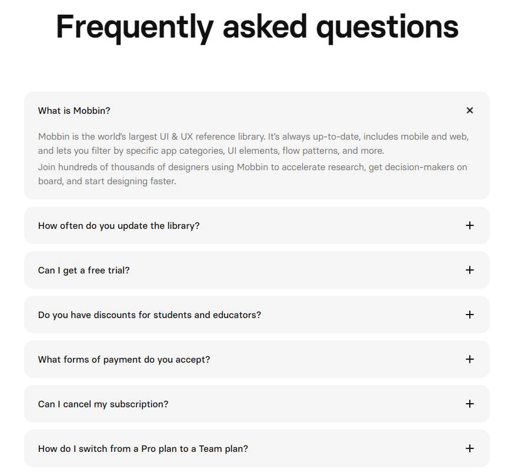

# Current Subscription Plan (based on current features)

Category:
- [Subscription tier](#subscription-page)
- [FAQ](#frequently-asked-questions)
- [Ways to enter subscription page](#ways-to-enter-subscription-page) 

## Subscription Tier
目前的subscription tier是基于截至7/19产品现有功能做的，现阶段三个等级主要还是在于credit数量的差别。（Full subscription plan可移步：）

Subscription Tier有三个等级：Free, Standard, Pro. 三个等级的权益如下：

| Free                                 | Standard                                | Pro                                 |
|--------------------------------------|-----------------------------------------|-------------------------------------|
| $0                                 | $10 per month (20% off annually)        | $15 per month (20% off annually)    |
| - 30 credits daily login rewards (resets daily) | - 700 credits per month. | - Unlimited credits during billing period.                |
| - Access to advanced AI language model        | - 60 credits daily login rewards(resets daily)                | - Access to advanced AI language model       |
|                                      | - Access to advanced AI language model           | - Early access to upcoming functions|
|                                      | - Early access to upcoming functions    |                                     |

样式参考:

文案：
- 顶部：Choose Your Subscription Plan
- Annually和Monthly: Annually在前 Save 20%，Monthly在后，打开Subscription网页时默认在Annually。
Annually页签里可以做成图中原价划掉打折的效果，Standard $10/month划掉变成$8, 下面小字 $96 billed annually；Pro $15/month划掉变成$12，下面小字 $144 billed annually. 

- Free, Standard, Pro每列除了包含图表里的Tier名称，价格和权益外，分别加button: Free 'Try now', Standard 'Upgrade to Standard', Pro 'Upgrade to Pro'。
'Try now'点击后跳转到Home页面，如果是没有注册的用户，跳转到Home页面后，需要立即跳一个login页面引导TA注册。
'Upgrade to Standard'和'Upgrade to Pro'跳转到支付页面，如果该user没有注册或没有登录，需要先让TA login。
- 在Pro列加类似参考图里的Recommended边框，引导user选这个等级，文案使用'Best Value'。

- 像参考图一样分成Annually和Monthly，user可以切换查看年付和月付的价格。
Annually即一次性买12个月，有8折优惠 Save 20%，做成图中原价划掉打折的效果，Standard $10 per month划掉变成$8, 下面小字 $96 billed annually，Pro $15 per month划掉变成$12，下面小字 $144 billed annually
- 打开Subscription网页时默认在Annually, 希望user选annually

By subscribing you agree to our Terms of Service（链接） and Privacy Policy（链接）.

- standard和pro plan订阅后自动续订，在下一次扣款前3天提醒user

*由于现阶段只是credit数量的差别，不涉及功能上的区别，所以不设置one-week free trial*

By subscribing you agree to our Terms of Service（链接） and Privacy Policy（链接）.

## Frequently Asked Questions

目前先在Subscription page下面放FAQ，以后guide齐全了，可以在这个page放链接跳转到guide中FAQ的地址，和ChatGPT一样。

样式参考下图，每个question右侧有个按钮，点击直接可看到answer，不用跳转至新网页 https://mobbin.com/pricing

FAQ list：
- What is Credit? 
Credit is an in-game resource in Rolling Sagas used for generating new text during gameplay. Each generation costs 1 credit.

- When do I receive my Credits for a Subscription? 
Credits are granted after successful payment of your chosen subscription. 

For annually purchase users, credits will be issused the day you purchase. 

Please note: credits will be reset every month. Credits included in subscriptions do not carry over from month to month.

- Can I transfer my Credits to others? 
Credits are tied to your account and are non-transferable.  

- How do I switch from Standard tier to Pro tier before due date? 
For monthly basis, the Pro benefits will take into effect immediately after your successful payment for the monthly pro plan. 

For annually plan, Annually Standard Plan to Annually Pro Plan, 

- How to cancel my subscription? 
Your subscription renews automatically based on the frequency specified on your subscription page (or monthly if not specified). To cancel, go to the subscription settings on your Profile page. Your cancellation will take effect at the end of the current subscription period.

- How do I request a refund? 
Refunds are not available for monthly subscriptions. However, users who purchase a 12-month subscription can request a refund within 3 days of purchase. Please contact us at support@rollingsagas.com.

More questions? Contact us at support@rollingsagas.com

PS. 自动续订和退款之后会正式做成policy放在guide网页，链接过去

[Check here](#membership-exposure)
先做1-4: Home Page, daily login rewards, 游玩过程中credit花完，和profile查看credit余额这4种情况  