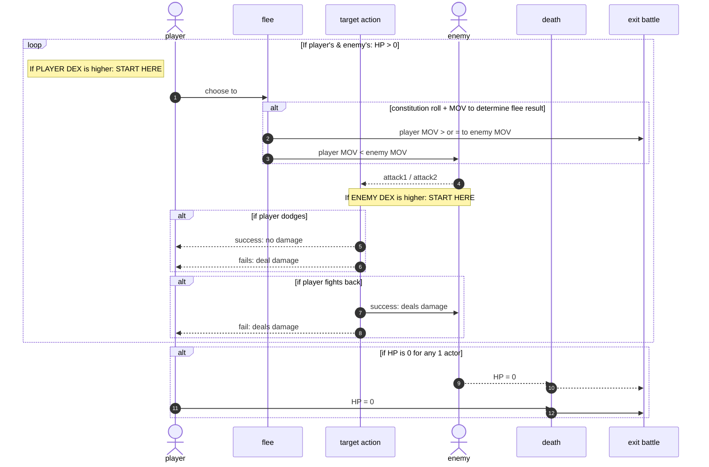

---
Battle: flee
---

```mermaid
    sequenceDiagram
    autonumber
    actor player
    participant flee
    participant target action
    actor enemy
    participant death
    participant exit battle

    loop If player's & enemy's: HP > 0
        note left of player: If PLAYER DEX is higher: START HERE
        player->>flee: choose to
        alt constitution roll + MOV to determine flee result 
        flee->>exit battle: player MOV > or = to enemy MOV
        flee->>enemy: player MOV < enemy MOV
        end
        enemy-->>target action: attack1 / attack2
        note over enemy, target action: If ENEMY DEX is higher: START HERE
        alt if player dodges
        target action-->>player: success: no damage
        target action-->>player: fails: deal damage
        end
        alt if player fights back
        target action->>enemy: success: deals damage
        target action-->>player: fail: deals damage
        end
    end
    alt if HP is 0 for any 1 actor
    enemy-->>death: HP = 0
    death-->>exit battle: 
    player->>death: HP = 0
    death->>exit battle: 
    end
```

