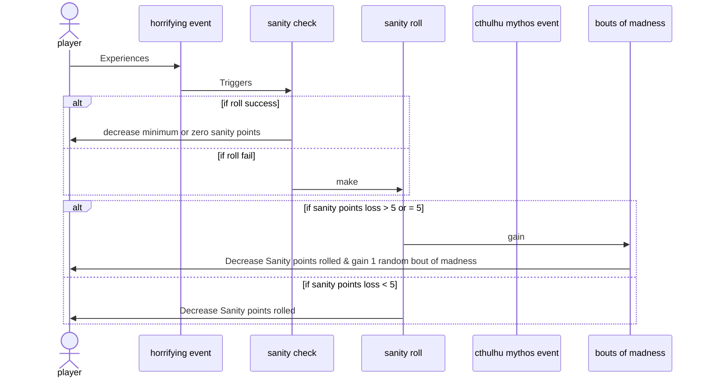
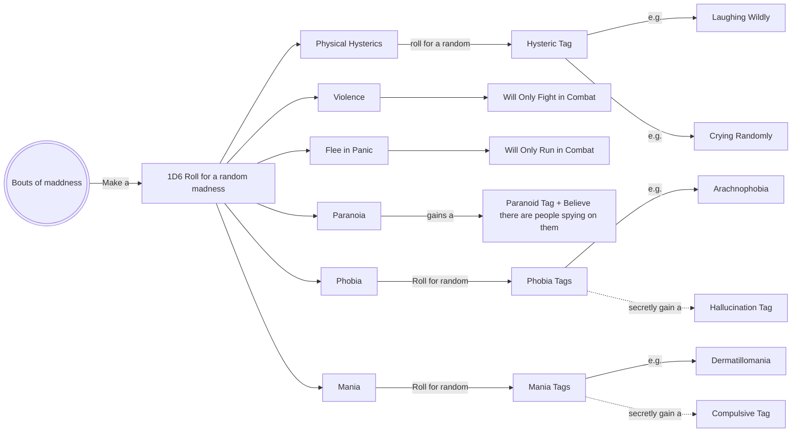

# Sanity

## Overview:
Sanity reflects the mental state of the player character's mind. The more it deteriorates, the less stable their minds become, and when they become insane, they would inherit a **BOUT OF MADNESS**.
    
Keep in mind that a person's mind can only take so much before succumbing to their death.

## Basic Rules

During chracter creation, your sanity points should also be calculated based on the **"POW"** characteristics. If the sanity points drop to **1/5** of its maximum, then they would inherit a **BOUT OF MADNESS**.

## Cause of Insanity

When the player character experiences events, horrors, or an encounter with other worldly beings, it would challenge their state of mind, whether or not they can hold it together, or fail and go insane. 

Luckily, during game play, there may be instances where your mind becomes clearer, or more grounded to reality, these are all opportunities for your sanity points to increase (*but never above your maximum*).

### Examples:
- Cthulhu Mythos
- Alien Creatures
- Grotesque Scenes
- Paranormal / Supernatural
- Monsterous Creatures
- Great Old Ones
- Other Worldly Horrors
- Undergo Torture
- Meet someone you know to be dead

And many more... 

Which ever horror is in the story it should affect the player character's sanity. But how is that calculated?

## Sanity Check & Roll

When the player's character experience some form of event from the above section, then they will need to **roll** a **1D100** die against the character's **current** sanity point to determine the **potential amount** of sanity points they would lose.

### Sanity Loss

Sanity Losses are described something like this: 

- 0 / 1D6

- 2 / 1D10

- 1 / 1D4 + 1

The slash seperates the initial **SANITY CHECK** your character has made. **LEFT** side of the slash is the sanity loss when the character made a **successful** sanity check. Where as the **RIGHT** side of the slash represents the sanity loss when the character **failed** their sanity check.

*As you can see, there are moments where despite the fact that you made a successful sanity check, you will still nonetheless lose sanity points.*

Thus:

- If you roll over, you will lose a greater amount of sanity.
    
- If you roll under, you will lose less sanity or none at all.

If your characters sanity points **drop** to **1/5** of your maximum, then the character will inherit a **BOUT OF MADNESS**.

Alternatively...

If your character loses **5 or more** sanity points from one roll (as in, an event or instance), then they would also need to make an **INT** roll to determine if they would inherit a bout of madness.
- If they **FAIL** this roll, then they **have not** gone insane (*A trick the mind uses to protect itself*)
- But if they **SUCCEED** the roll, then they will inherit a **BOUT OF MADNESS** (*The character was able to comprehend what they saw*). 

[For more sanity points loss examples, click here](../sanity/images/sanity_point_cost_example.png)

### Cthulhu Mythos Sanity Loss (For Future Updates)

Not all sanity loss are equal. When player character experiences a sanity loss due to **Cthulhu Mythos** induced trauma ( *e.g. seeing Mythos monsters, reading Mythos tome, etc.* ), they would also learn about the Mythos, allowing them to gain **Cthulhu Mythos Skill**.

- The **first instance** of Mythos-related **always add 5 points** to the Cthulhu Mythos skill.
- Any subsequence Mythos-related episodes or experiences will add 1 point to the Mythos skill.

Note that the **maximum Sanity points** decrease in respective to the amount of Mythos skill point gained.

*e.g. If a character has 5 points in Cthulhu Mythos, then their maximum sanity points will be 94 (99 - 5).*

[Sanity Loss Sequence Diagram](#sanity-sequence-diagram)

*note: if the character's **Sanity** drops to 1/5 of their **starting Sanity**, they would automatically gain a Bouts of Madness.*

## Bouts of Madness

When the character has gone insane, they would behave in certain way, this is what bouts of madness essentially is. During gameplay, when the player's character succumbs to insanity, they **roll** a **1D10** to determine a random bouts of madness exhibited by the character. 

[Bouts of madness](../sanity/images/bouts_of_madness_realtime.png)

But for our purposes, we won't use all the contents on this table, we will instead concoct some of our own madness.

Here is a compiled list of **our** bouts of madness:

1. **Physical Hysterics or Emotional Outbursts:** Laughing, crying, screaming, while speaking strangely.

2. **Violence:** During combat, the character will ONLY fight. They cannot not use items or flee.

3. **Flee in Panic:** During combat, the character will always flee. They cannot use items or fight. 

4. ~~**Hallucinations:** Character would injure themselves during their hallucinations.~~

5. **Paranoia:** Character suffers from paranoia, think they are spied on, tricked, and nothing can be trusted.

6. **Phobias:** Character gains a phobia and even imagines it being there for a few rounds.

7. **Mania:** Character gains a mania and acts on it? Maybe even imagine it?

*Note that the list above is subject to change depending on its ability to integrate into our gameplay*

[Bouts of Madness Flowchart](#bouts-of-madness-flowchart)

When the character loses more than or equal to 5 Sanity points, then the character will **roll a 1D6** to gain a random bout of madness. Depending on the madness type, the **effect** may be immediately applied, **or** the character will have to roll again to determine the specifics (e.g. For phobia, there would be another roll to determine the specific phobia the character is experiencing).

## Reality Check

Now that you are **insane**, you will also begin to see hallucinations or illusions, but a person with a broken mind don't often distinguish these from reality.

Luckily, the player's character has a chance to see through these hallucinations or illusions.

Simply make a **Sanity roll** to determine the result:

- **Failure:** Lose **1** Sanity point and immediately induce a bout of madness.
- **Success:** The character sees through the delusion

## Treatment and Recovery from Insanity (For Future Updates)

Thanks to "modern medicine" ( *depending on the era your character is in* ), there is still hope to keep your mind intact.

*Note that these are 1920's prices*

### Private Care

The best place to recover, but also the most expensive:

- Weekly: $25 - $50
- Monthly: $100 - $200
- Annualy: $1,200 - $2,400

Roll a **1D100** to determine the treatment success after **1** month.

- 1 - 95 is a success: Add **1D3** Sanity points.
- 96 - 100 is a failure: Deduct **1D6** Sanity points.

### Institutionalization

Cheap or even free, but the quality of care is most defintiely not the best...

- Free
- Weekly: $5 - $10
- Monthly: $20 - $40

Roll a **1D100** to determine the treatment success after **1** month.

- 1 - 50* is a success: Add **1D3** Sanity points.
- 51 - 95: No progress made.
- 96 - 100 is a failure: Deduct **1D6** Sanity points.

**50 is just an average. If the institution quality is below average, this number may be reduced even further. But if the institution is above average, then it could be increased.*

## Increasing Current Sanity Points

There are also other opportunities to increase a character's current Sanity points:

1. Campaign Completion Award: After completing a campaign, the character can recover **1D6** Sanity point.

2. Increasing a skill to **90%**: Character is awarded **2D6** Sanity points when one of their skill reaches such proficiency. 

3. ~~Psychotherapy: Make a **1D100** against a doctor's **Psychoanalysis skill** once a month.~~
    - ~~If successful: Gain **1D3** Sanity points.~~
    - ~~If failed: Lose **1D6** Sanity points.~~

---
Sanity Sequence Diagram
---

---
Bouts of Madness Flowchart
---

